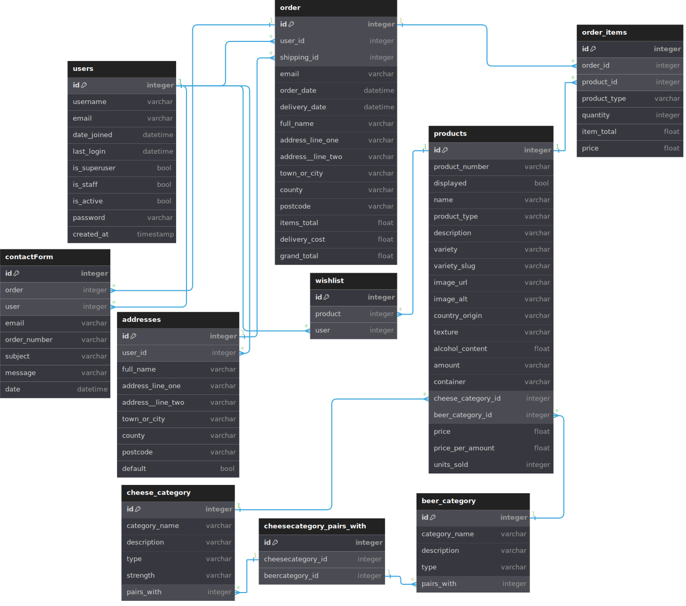

# Cheese and Beer

Cheese and Beer is intended to become the UK's premier marketplace for purchasing cheese on the internet.  It will be reasonably priced (unlike the majority of other similar providers), and the website itself focussed on brilliant UI which not only makes it easy for users to find what they want, but that helps them find something they perhaps didn't even know they wanted in the first place. It's the Apple approach to cheese. The brand plays on the unheralded but actually excellent combination of beer and cheese, and the platform itself will not only reward the true cheese enthusiasts but actively encourages gifting from casual cheese purchasers - as such the platform will be accessible to all and free from any impenetrable cheese terminology or jargon.

## Contents:

### UX Design

[UX Design - Strategy](#ux---strategy)\
[UX Design - Scope](#ux---scope)\
[UX Design - Structure](#ux---structure)\
[UX Design - Skeleton](#ux---skeleton)\
[UX Design - Surface](#ux---surface)

### The MVP

[Specification Changes](#specification-changes)\
[MVP Data Structure](#mvp-data-structure)\
[Feature List](#feature-list)

### Testing and Deployment

[Testing Documentation](#testing-documentation)\
[Deployment](#deployment)

### Credits and Technical

[Credits](#credits)\
[Technical Information](#technical-information)

## UX - Strategy 
([back to top](#contents))

### 1) Research

You don't have to look far to find the best online retailers.  Amazon is the benchmark for everyone, majestically filtering a product range which includes pretty much everything and enabling users to one-click purchase whatever is on their mind and deliver it the very next day.  There is a reason they are number one and I think every online retailer draws inspiration from them.

This website is for a specialist retailer though, so I have looked for examples in that area as well.  Paxton and Whitfield's website, for example, is exhaustive in content and slick in design, and provides a good benchmark for the sort of range a decent cheese retailer needs to be carrying.  I have also found guides on how to pair cheese with beer which I think will be very useful when making suggestions to the user.

One thing that strikes me about Amazon in particular but also the cheese retailer is the sheer number of menus, sub-menus and options.  Paxton and Whitfields has no fewer than nine options in their main navigation bar, which open admittedly very nice sub-pages when you mouse-over.  Amazon... well Amazon is just ridiculous (it gets even more ridiculous when you try and navigate AWS but that's another matter).  I think Amazon assumes a certain familiarity from the user, and gets away with a lot of bad UI as a result.  Most people know where to find what they need on there.  I pretty much never click and of the navigation links though, aside from my account options.  What would a new user make of it?  When you search for products and scroll down the page you get a heading saying more products, then the same heading again with even more products... then you finally get pagination! I think for a specialist site aimed at more casual users, you just can't get away with most of this - people will get lost and give up.  The simpler the navigation the better.  Of course, there is a huge caveat to this.  For the exact same reason it would be foolish not to emulate Amazon's site layout to some degree, so that the majority of users will feel comfortable and instantly be able to find where everything is.

When it comes to positioning and branding Paxton and Whitfield seems to be the upper end of the market. It assumes a certain level of knowledge about the products, as I'd imagine most visitors will have.  At the other end of the market is the supermarket, and whilst you can purchase a similar quantity of pretty decent cheese and get change from ten pounds, it does lack a certain sense of occasion.  There is room then, in the middle ground.  The cheese and beer branding should sit perfectly in this area - craft ales rather than fine wines, and enough sense of occasion to feel like you're doing something special without being unconfortable about the amount of money you're spending on it.  A site that isn't just for enthusiasts, but is for everyone.

### 2) Project Goal

Cheese and Beer is about the democratisation of cheese. To enjoy the product you don't have to buy artisan cheese made only in a small shed somewhere in Wales, and you shouldn't be made to feel like you have to. The website will be focussed on casual browsing and making that easy for the user, with a search facility for those who know exactly what they want.  Suggestions and tools to help users plan and budget their purchases will encourage engagement and upsell, and intuative and simple account and address management tools will make checking out and making purchases as gifts incredibly simple.  Whilst the gifting market will be strongly in mind, there will also be visitors who are just love cheese and beer and want to treat themselves or their families without breaking the bank, and the website will cater for them too.

### 3) Developer Goals

- Simplify the MVP:  Having learned hard lessons from the initial over-ambition of previous projects, and keeping in mind the modular nature of Django, I am aiming for an extremely lean MVP which I can then build upon.  The way the user stories and feature list are structured will provide absolute clarity on the work that needs to be done, work that could be done if there is time, and work that won't even be considered as part of this project submission.
- Take advantage of Django: Learning how to customise Django will be my biggest challenge, as I intend to take advantage of Django Forms, Allauth and crispy forms (not to mention Stripe which is compulsary!).
- Deliver a Real World project:  This is always my ultimate goal, but in this case it's particularly relevant.  This should be a project that could conceivably be switched on to take real customer orders once the MVP has been submitted.

### 4) Site Owner - User Stories

- Site Identity: The landing page needs to make people feel at home and get across the core values of the site.
- Clear Pathway:  As soon as the user lands on the site their pathway should be clear and the options they are presented with need to make them stick.
- Simple, familiar design:  There is no need to re-invent the wheel with this site, in terms of how products are presented, and there are plenty of excellent benchmarks out there.
- Uncluttered UI: I think it's important that users aren't overwhelmed with menu options, especially on mobile.  There is no need to overcomplicte a website about cheese (and beer).
- Engaging sales pathways: Although many features in this area may not form part of the MVP (see developed goals concerning keeping it simple) having novel and simple to use means of engagement, such as (for example) a cheeseboard generator, is key.
- Regulatory Compliance and Security: As I want this to be a real world application, no features will be implemented that are not compliant with best practice, such as PCI DSS regulations.  If implemented, things like storing user payment details should be done through Stripe (which presumably takes care of most of this).

### 5) Site Visitor - User Stories

The site is positioned, for want of a better description, to appeal to the cheese and beer layman.  For the end user, accessibility is key.

- A homepage like home: Users need to feel comfortable when they land on the site.  Not like they are being overly sold to, or that the site 'isn't for them'.  Homepage promotions should be informative first.
- Clear pathways: Once the user has landed on the homepage, they need a clear and obvious path to locate what it is they visited the site for in the first place.
- Recommendations: For users uninitiated in the world of cheese, it is important to have recommendations and suggestions, especially when it comes to pairing.
- Easy checkout: The user doesn't want to have to jump through a lot of hoops to do anything online, especially on mobile. They want to buy what they want and get gone.
- Seperate billing and delivery addresses: If a user is purchasing a gift it should be easy to add, select and save multiple delivery addresses.
- Retain key details:  People are used to once click shopping with Amazon's buy it now, for example.  Equally they also want to feel their data is protected.  This is a fine line.
- Review order history:  Customers would like to be able to review and track their orders, especially if everything doesn't go to plan. They want this re-assurance.

## UX - Scope
([back to top](#contents))

### Technology

The technology used will be HTML/CSS and JavaScript, and Python with the Django framework and a SQL-based relational database to store data, most likely using Django's built-in models.

I am lucky in that I have developed strong skills with vanilla Javascript and CSS Flexbox which means there is little to gain from using a heavy library like Bootstrap.  It's just as quick for me to hand-code my own media queries and in some ways quicker since Bootstrap needs a degree of customisation in any case.  I am also wary from a previous project of how awkward it can sometimes be to customise Bootstrap-based code.  Furthermore I don't want to slow my code down with multiple imports, where the majority of the code is actually unnecessary.  

One issue in dispensing with Bootstrap is the integration of Bootstrap JQuery libraries into the course material, and some of the custom methods that were used in the checkout process which I'm not sure how to replicate as yet. Whilst I can see the benefit of the shorthand, going forward I would rather invest time in learning something like React and REST APIs.  With the time limitations involved in this project, it is much easier for me to use the vanilla JavaScript I'm already familiar with - hopefully it will be pretty straighforward to build the vanilla JS code to emulate these methods, using fetch().

This all said, it is clear to me that some of the dependencies from the learning I have done (notably Stripe, Django, and AllAuth forms) benefit from using Crispy Forms and the templates that come with such libraries. I think there would be a very high development overhead in doing all this customisation myself (more so than building the forms from scratch). As such I have been looking at other CSS libraries that integrate with Crispy Forms, and have decided attempt to use Tailwind. It seems to be the most popular and easy to use framework out there, and from my research seems to come without a lot of the bloat associated with Bootstrap, relying as it does on a range of helper classes. Ideally, I want the best of both worlds - instantly formatted forms that are easy to customise where necessary. Speaking frankly it may even prove to be easier to style the whole website in the manner of the forms than the other way around!

### Structure

 - Home Page: Logo, menu and search in the main navigation for immediate browsing.  The main area of the page will feature two callouts - one linking to special offers and the other to the create your own cheeseboard feature (if included).  It will also feature a brief site mission statement.
 - Search/Filter:  Once a user either searches or filters the page via one of the menus, a familiar looking results screen will appear with basic product information which the user can browse.
 - Product view: When clicking on a product the page provides more detailed information plus the opportunity to add the item to the cart or purchase immediately, and a 'recommended' section which will focus on product pairing (cheese to beer, and beer to cheese (or sundries should they be integrated into the project.)).
 - Cart page:  If the user has filled a cart with items, they can review and update these items.
 - Checkout page:  Here the user selects/inputs their billing and delivery address, specifies whether the item is a gift (and if they want it wrapped) and enters their payment details, and which details they wish to retain (ie register as a user)
 - Confirmation page: This is where users will be provided with confirmation of their purchase.
 - Product update page:  The site is not envisaged as an amazon style marketplace, so the only users who will have access to this are designated administrators of the platform.  Here new products can be added and removed.
 - Order history (with varying permissions):  Users can view their own order history, customer services can view any of them, and managers/admins have update tools.  Not all of this will be in the lean MVP as it's not clear on the levels of permissions built into allauth, but obviously superuser isn't suitable in all (most??) cases.
 - Manage account:  User can change billing/delivery addresses, other personal details, or payment options (if included).  They can access their order history from here. Users which are not signed in will have the option to search for their order by order number to track it.

### Features

I have organised the feature list into multiple categories based on user stories, with a very strict MVP list, an expanded list which ought to be viable in the time allowed once the MVP has been completed (with hard work and good luck), and a nice-to-have list which I view as highly unlikely to be implemented as things stand.

#### Site Template (features accessible anywhere)

MVP FEATURES

 - Users can search the products on the site
 - Users can access their account information (including order history)
 - Users can access their shopping cart.
 - Users can process direct to checkout for anything in their cart.
 - Users can browse cheese products
 - Users can browse beer products

STRETCH FEATURES:

- Users can filter and browse sundry products (jams/chutneys/accessories/meats).
- Users can filter and browse special offers.
- Users can access BYO / randomized cheeseboard features.

#### Landing Page

MVP FEATURES:

 - Site description (clarity)
 - Site Logo (branding)
 - Site callout for specific products (immediate call to action)

STRETCH FEATURES:

 - Site callout/navigation for cheeseboard builder
 - Site callout/navigation for cheeseboard randomizer
 - Site callout/navigation for special offers

#### Search Results page

MVP FEATURES:

 - Users can browse a a list of products
 - Users can click to view individual products
 - Users can filter results by category by clicking on a product's category

STRETCH FEATURES:

 - Users can add x amount of the item to cart or checkout an item directly from search results.
 - Users can see paginated results.
 - Users can view associated recommendations by clicking on a link in the product's listing.

BLUE SKY FEATURES:

 - Users can share a product to social direct from the search results.
 - Users can select the number of results they want to see per page.
 - Users can enable infinite scrolling for results.

#### View Product Page

MVP FEATURES:

 - Users can view full product info
 - Users can click any product category to open another filtered list of results.
 - Users are presented recommendations for pairings with the product on this page(beer or cheese)
 - Users can add x amount of the item to the cart or checkout an item directly

STRETCH FEATURES

 - Add to cheeseboard feature (for BYO cheeseboard)

BLUE SKY FEATURES

 - Share product on social
 - Users can add product to a wishlist

#### Shopping Cart Page

MVP FEATURES:

 - Users can add or remove items from the cart
 - Users can increment or decrement the amount/quantity of an item they wish to purchase
 - Users can proceed to checkout
 - Users can easily return to what they were doing / the homepage

#### Checkout Page

MVP FEATURES:

 - Registered users can access saved addresses
 - Unregistered users can checkout
 - Unregistered users offered option to register prior to checkout
 - Users enter card details into secure checkout process
 - Registered users can opt to store addresses
 - Users can see order summary

STRETCH FEATURES:

 - Users can store card details for next time (this depends on stripe functionality - if it's not a Stripe feature this goes straight to Blue Sky as it would require a lot of reading)

BLUE SKY FEATURES:

 - Users can register as they checkout if they enter a password (NB this would require a custom authorisation system rather than using AllAuth)

#### Order Confirmation Page

MVP FEATURES:

 - users see an order summary.
 - users are provided with an order number referencing their order.
 - users are provided a route back to the site.

BLUE SKY FEATURES:

 - users have option to share their purchase on social.

#### Account Page

MVP FEATURES:

 - Users can edit and update addresses
 - Users can view order history
 - Order history page allows drilling down into individual orders

STRETCH FEATURES:

 - Users can update payment options

BLUE SKY FEATURES:

 - When viewing past orders users can raise a ticket (This is probably un-necessary in a test iteration of the site but will be essential if it ever goes into production, along with some kind of CRM for issue handling, including amending orders and processing refunds.)

#### Admin Features

MVP FEATURES:

 - Admin user can access 'add products' page
 - Admin user can add products
 - Admin user can delete products
 - Admin user can edit products

BLUE SKY FEATURES:

 - Admin user can view sales volumes
 - Admin user has access to stock control algorithms to help stock purchasing or promotional decision making

## UX - Structure
([back to top](#contents))

As with the Scope, it is important to make clear at that the below is the structure envisaged at the beginning of the project, and that there was always anticipated to be an evolutionary process in producing an MVP.  For a full overview of specification changes in the finished MVP, please click [HERE](#specification-changes).

The data structure for the submitted MPV can be found [HERE](#mvp-data-structure).

### Site pages and elements

#### Main Template and Navigation

The homepage navigation will emulate to a degree the way Amazon is arranges, with a small logo, prominent search and key navigation arranged horizontally across the top of the screen.  On mobile this stacks to arrange the navigation filters below the search and account links.  For logged in users the can access their account details at the top right of the page, as is convention.

Although I generally try to avoid drop-down menus, I believe they will be necessary to allow users to filter without multiple clicks, but I do not wish menus to go more than 1 deep.  Javascript will be effective on desktop, and allow users to filter all by category with one click whilst using mouseover to reveal other options.  For mobile this will require 2 taps but I think users will be used to this.

#### Results Page

Basic product details will be shown on results pages, with an initial 4-8 items shown and the option to view more (as with Amazon).  I would like to include pagination if I have time, but on such a niche site the small number of products available should mean it's not an essential (and it would require learning from scratch to do it with Django although I'd imageine the principle is the same as with anything else!).  I'm also keen to have instant checkout options here (everywhere in fact) as somtimes people just know what they want and the shopping cart mean unnecessary extra clicks.

#### Item Page

This will contain full product information, more order options and a recommendation section, which will pair beer with cheese.  This will be pretty straighforward process and the pairings will be set on product creation as part of the data modelling.

#### Shopping Basket Page

The concept involves allowing users to edit their basket and also add giftwrap/convert to cheeseboard (if included) options on the page.  These are nice to have options but they should be straightforward to include and I think are close to essential on a site which will lean heavily towards gifting.  If I include as planned and instant checkout option then these options will also need to be available on the checkout page, as well as the option for a user to change their mind.  It's important in these sorts of cases the user doesn't have to go hunting to achieve what they want to achieve.

#### Checkout Page

I intend to give users a choice of saved addresses, and the option to designate a seperate billing / delivery address using Javascript to show/hide and autofill fields if boxes are checked or unchecked.  I think the convenience of this is a key part of what makes Amazon so successful.  I would also like to do the same for payment details, but that will be time-restricted as there are a lot of extra considerations when it comes to storing sensitive financial data which I think are beyond the scope of this project.  The theory remains the same however, minimal user input to acheive the end result, creating a seamless experience.

#### Confirmation Page

This will be straightforward so I haven't wireframed it, but I also want to provide unique order references so that users can track their order without logging in and provides a point of reference.  This is very important for unregistered users that are not logged in.

#### Add / Edit Product Page

I've considered a number of complex iterations of this, but in the end it will be very simple case of choosing to add beer or cheese and then having near identical forms to fill out in the style of the wireframe. It could be condensed to a single page and the form presented and controlled using Javascript and a drop-down, but it makes little sense to spend time on this when it is only for site-affiliated admin users, which in practice will only ever be me.  That said, although this website is not intended to be a storefront, it will be formatted so that other admin users find it a pleasure to use. It will also have proper image handling so that images are uploaded and stored in the proper size and format rather than this being incumbent on the user. Searching for products will also provide admin users the chance to edit products (but they can only be deleted from the edit item page, I'm keen not to make that too easy).  I also think it will make sense that for any product which has been involved in an order to have a for a hide option rather than a delete, which hides them from the user using an availability toggle - items may often be temporarily unavailable and if something has been sold in the past it's important to retain that link to the order history.

#### Account Section

This will be a simple menu offering order history, manage addresses or update personal details.  Order history will be a simple list of orders that can be expanded when clicked on.

### Core Data Structure

Please note that this section represents the initial design phase for the database schema, and may well be subject to change.

Having used MongoDB in my previous project, I'm glad that a relational database will be used in this one - it means that data can be broken down into chunks and their relationships with each other can be tracked and indexed very easily and my Python code should be a lot simpler (theoretically).

My main decisions when modelling the data for this project are whether I need sub-models for the various classes of product.  In the end I have decided that the bulk of the information for each product will be defined by the type (cheese or beer) and then category selected from a drop-down dependent on the type.  This will be extremely handy when it comes to making recommendations on the item page and will make product creation a simple matter of adding a name, image, price and quantity, then selecting the appropriate category from a drop-down.  Each product will be sub-class of the selected type and category (eg Camembert) and inherit its characteristics, likewise for beer.  I belive this functionality is built in to Django Models so should be easy to implement. It ought to make creating products very easy, as the user can opt to either keep the general category description or edit it to their own.  

Apart from that everything will be very straightforward, except that addresses will have their own data model linked to the user by a foreign key so that users can save multiple addresses.  It will also make it easy to track which addresses have been used in the order history, should users subsequently change their address.

I am keen that users log in with their e-mail.  It is rare pepole are able to remember their username, especially as often the one they are most likely to use is already taken.  Personally, there is little more frustrating.  Because the e-mail address is a unique piece of data, I don't know why anyone would do it any other way unless they are safeguarding against very weak passwords, which will be taken care of in this case when they are created.

#### Schema Diagram

#### Users Model

This will include basic user authentication data, for the most part created by AllAuth.  

#### Addresses Model

This is the model for user addresses, which also logs the associated user ID and whether it is a billing or shipping address.  For shipping addresses there will also be the option to add a shipping name, which will default to the user's name for billing addresses.

#### Cheese Category Model

Will include details of generic cheese types, from Goat's Cheese to Gruyere, along with their characteristics and pairing recommendations.

#### Beer Category Model

Will include details of generic beer types, along with their characteristics and pairing recommendations.

#### Products Model

A unique product which will include type, name, description, images, price, and will relate to an order history.  Related to the selected category model.

#### Orders Model

Each table entry will be for a seperate order, logging who ordered it, when, the total order value, additional options selected, plus the billing and shipping address foreign keys.

#### Order Items Model

A record of each individual item ordered, linked to an order by foreign key as well as the product.

## UX - Skeleton
([back to top](#contents))

### Design Choices

 - I've kept the site layout as simple and familiar as possible, looking to emulate the layout of similar sites that users will be familiar with.
 - The intention is that users are able to to make a purchasing decision from pretty much anywhere and with minimal clicks (as with most online retailers)
 - The navigation is designed to stack on mobile but users will still have access to navigation icons.  I do not want users having to negotiate multiple clicks to find what they want on smaller screens.  Neither do I want mobile users to lose any core functionality or visual clarity.
 - When products are displayed the balance is to show the information the user needs without overloading the page.  As such initial search results are limited and the user can opt to view more if they want to.  Again this is a concept borrowed from Amazon.
 - Entering new products is designed to be as fast and simple as possible with nominal information required and a lot of core info stored in the item category section.  The categories will require some work to get right.
 - When checking out the strategy is to only show information the user needs on the screen.  For example if the user checks the box to ship to the billing address, or if they have default billing and shipping addresses the want to use, then they don't need to see an address form.  

### Wireframes

Please find the wireframes [HERE](WIREFRAMES.md).

## UX - Surface
([back to top](#contents))

### Color Palate

#### Color Names

TBC

#### RGB

TBC

### Fonts

TBC

#### Titles/some buttons

CfDavesDreamPersonalRegular-WyAGn.ttf

#### Main font

OpenSans-Regular.ttf

### Images

#### Site Theme

TBC

#### User Avatars

TBC

### Navigation

TBC

### Alerts

TBC
  
### Responsiveness

TBC

## The MVP

### Specification Changes
([back to top](#contents))

As Donald Rumsfeld memorably said:

"There are known knowns. These are things we know that we know. There are known unknowns. That is to say, there are things that we know we don't know. But there are also unknown unknowns. There are things we don't know we don't know."

### MVP Data Structure
([back to top](#contents))

As anticipated, the final data structure is significantly more complex than the basic structure outlined at the outset of the project.  i have outlined significant changes below:

CHEESE AND BEER CATEGORY MODELS

All custom fields were moved to the products model, and the many to many relationship is represented in a seperate table to reflect how it is handled by Django

PRODUCTS MODEL

Many fields have been added as the project has progressed.  Most notably the model now tracks units sold, and has a 'displayed' option.  This is to reflect how you do not really want to wipe a product and its order history from a database even if it isn't sold any more; this button hides the product from search results. Although users can still view the product from their order history or bookmarks they can't purchase it and they have a clear indicator it is unavaliable.

USERS MODEL

Although I haven't added additional roles to the table as I would like to in the future, I have set all logins and validation to be done via e-mail.  The Allauth login no longer requires a username, because I have built a signal to set the username to equal the user's e-mail address pre-save.  I have also disabled e-mail verification for signup. This makes for a far better user experience and a very slick sign-in process to ensure no potential customer is lost at checkout.

ORDERS MODEL

This now contains an estimated delivery date for every order.  This will reflect the date that is passed to the view when users are making their purchases.

CONTACT FORM MODEL

I have created a contact form model so that users can make queries regarding their orders.  If a use is logged in their data autopopulates, and if they click though from an order this carries over as well. The messages received are currently displayed in the admin site in a very basic view, but for a production site this could become a full-blown ticketing system without too much additional work.

WISHLIST MODEL

Logged-in users can now add items to or remove them from their wishlist from any product page.  THey can also view their wishlist and purchase items from it via their account page or the menu.  This was a simple to implement custom model which enhances user experience.

#### Schema Diagram

### Feature List
([back to top](#contents))

The final feature list for the MVP contains everything from the initial outline, with additional features documented here including the wishlist and contact form.  Focus has been on providing an enhanced experience for logged-in users.  This is notable on the checkout page where users are able to select and update addresses as well as a default address, and a very neat interface for doing so.  From landing on the homepage a logged in user is 3 clicks from making a purchase, and all they have to enter is their card number and CVV.  Additionally the user account page now provides multiple options, including the contact form and wishlist.  The orders and view order pages now provide direct access to the contact form with pre-populated details.  In fact as the site designer I highly recommend logging in before you use it!

Beyond this though, even if a user is not registered they can still access their orders if they provide multiple exact details, and can still contact the customer services team (ie me).

## Testing Documentation
([back to top](#contents))

Please find all testing documentation [HERE](TESTING.md).
  
## Deployment
([back to top](#contents))

### Initial Deployment

Hopes and Dreams has been deployed [HERE](https://hopes-and-dreams-15b83f2d1383.herokuapp.com/) via Heroku, taking the following steps:

Preparing for Deployment:

- For the site to function, I needed to add a Procfile to the repo containing the command to start the app (web: python app.py).
- I already had an up-to-date requirements.txt file in my repository which I updated as I installed new dependencies.  This was a product of developing my project using a virtual environment in VS Code.
- On initial deployment I received error messages related to my image handling code. This was on account of Heroku using a different version of Python which was actually ahead of the official version!  In order to make the app function as intended, I needed to add a runtime.txt file to the repo containing the Python version used for this project (python-3.10.12).

Creating the App and connecting to Github:

- I logged into my Heroku account.
- From my Dashboard, I selected 'new' then 'Create new app'.
- I selected an available name appropriate to the website - in this case I chose hopes-and-dreams, before selecting my region (Europe) and clicking the 'create app' button.
- Heroku immediately took me to the 'Deploy' page.  From this page I went straight to 'Deployment Method' and clicked on Github.
- Once my Github account was connected, I selected the hopes and dreams repository and clicked 'connect'.
- Once connected I enabled automatic deploys, which means the deployed site automatically updates when it detects a new commit to the linked repository.

Setting up the deployment:

For the site to function I also needed to add the correct environment variables.

- I first went to the settings tab and selected 'Reveal Config Vars' from the 'Config Vars' menu.  
- I then proceeded to add all of my environment variables to this section and save them in turn.
- The final step prior to submission was to ensure the 'DEBUG' environment variable was set to 'false'.

### Deploying this Project

If you wish to deploy this website yourself, here is how to go about it.

#### Create a Version of the repository:

 - Log in to or create your own Github account [HERE](https://github.com/).
 - Go to the Hopes and Dreams repository [HERE](https://github.com/rowlandcoping/hopes-and-dreams) and select 'Fork' to create your own snapshot of the repository.

#### Creating your own Heroku Account:

 - Sign in to Heroku [HERE](https://www.heroku.com/).  Keep in mind you will need two-factor authentication to use this website.
 - To use Heroku, unless you have access by some other means, you will need to purchase some platform credits.  For a basic deployment, this won't cost you more than $5/month.

#### Creating the database:

This project uses MongoDB to store all data, therefore you will need a copy of the database to deploy it for yourself.

 - Sign up to MongoDB Atlas [HERE](https://www.mongodb.com/cloud/atlas/register).
 - Create a database (call it what you like, but something indicative of the project is a good idea!).
 - Use the database structure outlined in this readme to re-create the database.  Keep in mind you only need to create the collections - the beauty of MongoDB is that everything else will be created on the fly.
 - Keep in mind if you want administrator access you will have to manually add the key/value pair user: "administrator" to the document for that user in Atlas.

#### Creating a Cloudinary Account:

This project hosts all images on Cloudinary.  In order to do the same you will need a Cloudinary account.

 - Sign up to Cloudinary [HERE](https://cloudinary.com/).

 Creating an email for the password reset functionality:

For this project I used gmail to set up an account through which all password reset e-mails are sent.

 - Set up a gmail account [HERE](https://gmail.com)
 - Once in gmail I set up a specific app password so that the app can connect to it via SMTP.  Find details of this [HERE](https://support.google.com/mail/answer/185833?hl=en-GB).  Keep in mind this app password resets if you change the password of the gmail account!

#### Deploy to Heroku

 - Once all of this is set up, you are ready to deploy - first use the instructions I outlined in the [Initial Deployment](#initial-deployment) section.
 - When it comes to setting up the config vars, you will need to set them up according the details of your own database/cloudinary/gmail accounts.  I have included below a list of all the [environment variables](#hopes-and-dreams-environment-variables) that need to be set up on Heroku, and indeed in any local deployment via an env.py file.

### Continuing the Project

Once the deployment steps have been completed, as above, you will be in a great position to continue the project.  All you will need to do is set up the [environment variables](#hopes-and-dreams-environment-variables) in your chosen development environment.

Using VS Code on Linux:

Using VS Code to continue the project is actually a simple matter because you already have the requirements.txt. I have used it throughout and I have found it straightforward to set it up on a second machine using a venv and the requirements.txt file.

Setting up:

- Install Linux on your machine. You can either dual-boot like I do, or even install a virtual version in Windows.  Either approach is much more straightforward than trying to use VS Code native in Windows, for a number of reasons.  [HERE](https://itsfoss.com/guide-install-linux-mint-16-dual-boot-windows/) is a guide to setting up a dual boot install.
- Install VS Code [HERE](https://code.visualstudio.com/download)
- Click Extensions and search for 'github'.  You want to install 'GitHub Pull Requests and Issues'.
- You should see a github icon you can now use to log in to Github.  Restart VS Code at this point.
- Press CTRL-shift-P to open the command palette and then type 'git:clone'.
- Select this, then click 'clone from github' before selecting your forked repository of Hopes and Dreams.
- Create a folder in an appropriate location.  I save all my repos in a folder called 'repos'.
- You will now be set up and connected to the appropriate repo and the files should all be available in VS CODE, including requirements.txt

Making it work:

- Create an env.py file and a .gitignore file.  Add env.py to your .gitignore file to ensure you don't upload sensitive data to the public repository!
- Ensure you have python3-venv installed ($sudo apt get update, then $sudo apt-get install python3-venv).
- Press CTRL-shift-P again, then type in python: Create Environment.
- Select Venv, then select the recommended settings to create a new virtual environment. It will install all the dependencies outlined in the requirements.txt file.  If it has worked you should see (.venv) in your terminal.  I found depending on the system I had to restart VS Code to make this work.

// add a bunch on setting up .env here
- Add the [environment variables](#hopes-and-dreams-environment-variables) to your env.py file. Be sure to update the Base_URL to reflect the port you are using locally as opposed to any deployment on Heroku.  Normally it's 127.0.0.1:5000/.
- If you type python3 app.py in your new virtual environment in VS Code, you should see the site working in your if you open the port. You can now continue to develop the project.

### Cheese and Beer Environment Variables

TBC

CLOUDINARY (also TBC but will be similar):

All the details for your Cloudinary account are provided on your Cloudinary Dashboard when you log in.

os.environ.setdefault("CLOUD_NAME", "xxxxxxx")\
    _as found on your Cloudinary dashboard_\
os.environ.setdefault("API_KEY", "xxxxxxxxxx")\
    _as found on your Cloudinary dashboard_\
os.environ.setdefault("API_SECRET", "xxxxxxxxxxxxxxx")\
    _as found on your Cloudinary dashboard_\
os.environ.setdefault("CLOUDINARY_BASE", "https://res.cloudinary.com/xxxxxxxxxxxx/image/upload/yyyyyyyyyyyyy/")\
    _this is the base URL for cloudinary images - please note the 'xxxxxxx' portion is the same as your cloud name.  If you view an image in the cloudinary explored and check the 'original url' you will be able to find the second part._

GMAIL (TBC but will be similar):

os.environ.setdefault("MAIL_SERVER", "smtp.gmail.com")\
os.environ.setdefault("MAIL_PORT", "465")\
os.environ.setdefault("MAIL_USE_SSL", "True")\
os.environ.setdefault("MAIL_USERNAME", "xxxxxxxxxxxxx")\
    _the e-mail address you've set up with gmail_\
os.environ.setdefault("MAIL_PASSWORD", "xxxxxxxxxxxxxxxx")\
    _the app password you've set up with gmail_

CUSTOM (will be similar):

os.environ.setdefault("BASE_URL", "xxxxxxxxxxxxx")\
    _this is the base URL for your site deployment.  For example, for my deployment of Hopes and Dreams this is https://hopes-and-dreams-15b83f2d1383.herokuapp.com, for your localhost it will be something like http://127.0.0.1:5000/_

## Credits
([back to top](#contents))

### Fonts

TBC

### Images and Icons

IMAGES:

All avatar images were created using Bing Image Creator.\
All other site assets were created myself using Inkscape.

As such all images belong to me.

ICONS:

Icons are from Font Awesome.

### Content

© 2023 John Hall.

### Code

### Acknowledgments

HELP AND ASSISTANCE:

Enormous credit goes to my mentor Mitko Bachvarov for his patience and assistance throughout this build.  His feedback about the UI in particular resulted in major changes for the better to the sign-up and editing process and a significant re-build since Christmas - I'm not sure how I would have completed this project to any kind of standard without this.  I feel certain he must be one of the best mentors working with Code Institue and very fortunate to have had access to his insight.

## Technical Information
([back to top](#contents))

Version Control: Git and Github.\
JavaScript validation: jshint.\
Python validation: CI Python Linter.\
Framework: Django.\
Image Hosting: Cloudinary.\
DBMS: PostgreSQL via Django.\
SMTP Mail Server: Gmail.\
Languages: HTML, CSS, JavaScript, Python.\
Development Environment: VS Code on Linux.\
Wireframes: Balsamiq.\
Database Modelling: dbdiagram.io\
Image Creation: Bing Image Creator & Inkscape.\
Image Editing: GIMP.
Screen Capture: Kazam.

([back to top](#contents))