# Testing Documentation

([return to README](README.md))

## Contents

### Audit and Validation

[HTML Validation](#html-validation)\
[CSS Validation](#css-validation)\
[JavaScript Validation](#javascript-validation)\
[Python Validation](#python-validation)

### User Story Validation

[Site Owner User Stories](#site-owner-user-stories)\
[Site Visitor User Stories](#site-visitor-user-stories)

### Testing

[Automated Testing](#automated-testing)\
[Manual Testing](#manual-testing)\
[Bugs and Issues](#bugs-and-issues)

## Code Validation

### HTML Validation
([back to top](#testing-documentation))

I have validated the html code by copying and pasting the source code from each page into the w3c validator [HERE](https://validator.w3.org/).  When formatting the code I have decided to format the Jinja2 templating without indents to preserve the integrity of the HTML.

UNIVERSAL PAGES

Page validated: Home\
URL: https://cheese-and-beer-896aa5a35920.herokuapp.com/ \
Repaired Issues: stray tags\
Outstanding Issues: None.

Page validated: Find Order\
URL: https://cheese-and-beer-896aa5a35920.herokuapp.com/my-account/find-order/ \
Repaired Issues: label for attributes remained from a different form\
Outstanding Issues: None.

Page validated: 404 page\
URL: https://cheese-and-beer-896aa5a35920.herokuapp.com/typeanthinghere/ \
Repaired Issues: missing image alt\
Outstanding Issues: None.

Page validated: Products list page and search\
URL: https://cheese-and-beer-896aa5a35920.herokuapp.com/view-products/?query= \
Repaired Issues: missing image alt, illegal query from where I was using category name, changed to id, some nesting issues. superfluous duplicate ids.\
Outstanding Issues: None.

Page validated: View Product Page\
URL: https://cheese-and-beer-896aa5a35920.herokuapp.com/view-products/product-detail/xxxx/ \
Repaired Issues: missing image alts, illegal query from spaces in variety names (Added variety_slug field, populated database, added variety GET query). Some nesting issues. superfluous duplicate ids.\
Outstanding Issues: None.

Page validated: Checkout Page\
URL: https://cheese-and-beer-896aa5a35920.herokuapp.com/checkout/ \
Repaired Issues: missing image alts, stray tags, placeholders in hidden fields. Issue where there are two address forms on page populated from the same django model. Solved by removing id attributes from the form that isn't submitted via checkout.\
Outstanding Issues: None.

Page validated: Checkout Confirmation Page\
URL: https://cheese-and-beer-896aa5a35920.herokuapp.com/checkout/confirmation/xxxx \
Repaired Issues: missing closing tags\
Outstanding Issues: None.

Page validated: Basket Review Page\
URL: https://cheese-and-beer-896aa5a35920.herokuapp.com/basket/ \
Repaired Issues: missing image alts, some superflous duplicate ids, one for styling reasons solved using specificity instead
Outstanding Issues: None.

ALLAUTH PAGES

Page validated: Login Page\
URL: http://127.0.0.1:8000/accounts/login/ \
Repaired Issues: Allauth ariadescribedby attribute in password field didn't have companion field.  Solved by pasting the source code instead and deleting it.\
Outstanding Issues: None.

Page validated: Signup Page\
URL: https://cheese-and-beer-896aa5a35920.herokuapp.com/accounts/signup/ \
Repaired Issues: Allauth ariadescribedby attribute in password field didn't have companion field.  Solved by pasting the source code instead and deleting it.\
Outstanding Issues: None.

Page validated: Password Reset Page\
URL: https://cheese-and-beer-896aa5a35920.herokuapp.com/accounts/password/reset/ \
Repaired Issues: None. \
Outstanding Issues: None.

Page validated: Password Reset Done\
URL: https://cheese-and-beer-896aa5a35920.herokuapp.com/accounts/password/reset/done/ \
Repaired Issues: Unclosed elements. \
Outstanding Issues: None.

Page validated: Password Reset From Key\
URL: https://cheese-and-beer-896aa5a35920.herokuapp.com/accounts/password/reset/key/ \
Repaired Issues: Unclosed Elements. \
Outstanding Issues: None.

Page validated: Password Reset From Done\
URL: https://cheese-and-beer-896aa5a35920.herokuapp.com/accounts/password/reset/key/done/ \
Repaired Issues: Unclosed Elements. \
Outstanding Issues: None.

USER ACCOUNT PAGES

Page validated: My Account\
URL: https://cheese-and-beer-896aa5a35920.herokuapp.com/my-account/ \
Repaired Issues: None. \
Outstanding Issues: None.

Page validated: Manage Addresses\
URL: https://cheese-and-beer-896aa5a35920.herokuapp.com/addresses/ \
Repaired Issues: None. \
Outstanding Issues: None.

Page validated: Add an Address\
URL: https://cheese-and-beer-896aa5a35920.herokuapp.com/addresses/xxxx/ \
Repaired Issues: None. \
Outstanding Issues: None.

Page validated: Edit an Address\
URL: https://cheese-and-beer-896aa5a35920.herokuapp.com/addresses/edit-address/xxxx/ \
Repaired Issues: None. \
Outstanding Issues: None.

Page validated: Orders Page\
URL: https://cheese-and-beer-896aa5a35920.herokuapp.com/my-account/orders/ \
Repaired Issues: Stray tags, nesting issues. \
Outstanding Issues: None.

Page validated: View Order Info\
URL: https://cheese-and-beer-896aa5a35920.herokuapp.com/my-account/order-info/xxxx/ \
Repaired Issues: missing image alts, duplicate id in undisplayed element. Solved this by removing id as it was superfluous. \
Outstanding Issues: None.

Page validated: View Wishlist\
URL: https://cheese-and-beer-896aa5a35920.herokuapp.com/my-account/wishlist/ \
Repaired Issues: missing image alts, duplicate superfluous ids. Also duplicate ids which meant creating a container div. \
Outstanding Issues: None.

Page validated: Contact Us\
URL: https://cheese-and-beer-896aa5a35920.herokuapp.com/my-account/contact/ \
Repaired Issues: duplicate stray ids in input elements. \
Outstanding Issues: None.

Page validated: Contact Us Confirmation Page\
URL: https://cheese-and-beer-896aa5a35920.herokuapp.com/message-sent/xxxxxx \
Repaired Issues: stray tags, unclosed tags. \
Outstanding Issues: None.

ADMINISTRATOR ONLY PAGES

Page validated: Admin Console\
URL: https://cheese-and-beer-896aa5a35920.herokuapp.com/admin-console/ \
Repaired Issues: nesting issue with button inside an anchor.  converted to and styled a span. \
Outstanding Issues: None.

Page validated: Add Cheese Category\
URL: https://cheese-and-beer-896aa5a35920.herokuapp.com/products/add-cheese-category/ \
Repaired Issues: issue with empty src element in hidden element used to preview images.  struggled to add holding image until I realised the load static tag doesn't carry over from base.html, and had to be loaded in the template.  \
Outstanding Issues: None.

Page validated: Add Beer Category\
URL: https://cheese-and-beer-896aa5a35920.herokuapp.com/products/add-beer-category/ \
Repaired Issues: empty src attribute. \
Outstanding Issues: None.

Page validated: Edit Categories\
URL: https://cheese-and-beer-896aa5a35920.herokuapp.com/products/edit-catgories/ \
Repaired Issues: None. \
Outstanding Issues: None.

Page validated: Edit Cheese Category\
URL: https://cheese-and-beer-896aa5a35920.herokuapp.com/products/edit-cheese-category/xxxx/ \
Repaired Issues: Unclosed elements. \
Outstanding Issues: None.

Page validated: Edit Beer Category\
URL: https://cheese-and-beer-896aa5a35920.herokuapp.com/products/edit-beer-category/xxxx/ \
Repaired Issues: None (fixed prior to validation). \
Outstanding Issues: None.

Page validated: Add Beer\
URL: https://cheese-and-beer-896aa5a35920.herokuapp.com/products/add-beer/ \
Repaired Issues: removed unnecessary label for django form radio input. \
Outstanding Issues: None.

Page validated: Add Cheese\
URL: https://cheese-and-beer-896aa5a35920.herokuapp.com/products/add-cheese/ \
Repaired Issues: None. \
Outstanding Issues: None.

Page validated: Edit Existing Product\
URL: https://cheese-and-beer-896aa5a35920.herokuapp.com/products/edit-product/ \
Repaired Issues: Stray tag, nesting issue. \
Outstanding Issues: None.

Page validated: Product Edit Page\
URL: https://cheese-and-beer-896aa5a35920.herokuapp.com/products/product-edit/xxxx/ \
Repaired Issues: removed unnecessary label for django form radio input. \
Outstanding Issues: None.

Page validated: View Customer Messages\
URL: https://cheese-and-beer-896aa5a35920.herokuapp.com/admin-console/view-messages/ \
Repaired Issues: nesting issues, stray tags. 
Outstanding Issues: None.

### CSS Validation
([back to top](#testing-documentation))

All my css for this project is present in a single file, partly because many of the styles are re-used across multiple pages, and partly because this means with the low file size of my css file the site will run faster, loading fewer static resources.

File Validated: base.css\
URL: https://cheese-and-beer-896aa5a35920.herokuapp.com/ \
Repaired Issues: 2 issues found - 1 incorrect use of relative and 1 legacy negative padding value which was removed.  I also had a few warnings about two elements with borders the same color as their backgrounds, and a further 3 warnings about the CSS used to hide the native html used to adjust for an integer field. I have not fixed these warnings, in the first case because it is intentional behaviour (the border is set like this so that the elememt size is constant and it stands out on hover).  In the second case the CSS is purely cosmetic, so if for example a 95 year old is still for some reason using Internet Explorer and the field adjuster is not hidden it won't affect the functionality or layout of the site at all.\
Outstanding Issues: None.

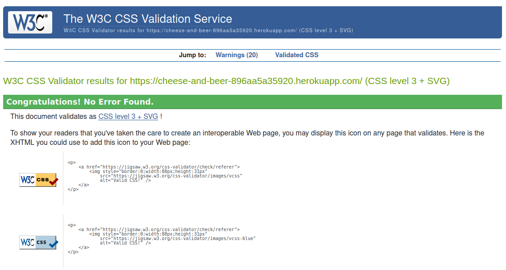

### JavaScript Validation
([back to top](#testing-documentation))

I have decided to put all the Javascript in one file for this project. One reason for this is that a number of my Javascript functions work across multiple views.  Where this is not the case I have taken the measure to ensure functions or listeners aren't active unless the required element is present on the page.  Opinion is mixed as to whether this is best practice or not but on a small project like this one I see no need for multiple resources, especially with the small file size of my script.js file, coming in at around 700 lines of code.

I have validated my JavaScript file (script.js) using [JSHint](https://jshint.com/)

Repaired Issues: 

I had to refactor some code due to the way I had set up a function, and I added a large number of semicolons.  I also found some undeclared variables which also required some refactoring.  The one outstanding error refers to Stripe, which JSHint sees as an undefined variable.  I believe this is unavoidable due to the way Stripe functions and the context in which JSHint lints the code - even in my editor it is flagged as undefined, however the Stripe functionality works perfectly which means I do not believe it is a problem.\
Outstanding Issues: Stripe flagged as undefined.

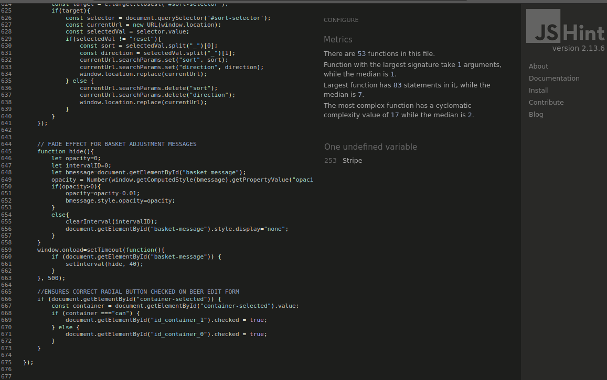

### Python Validation
([back to top](#testing-documentation))

I have used the [CI Python Linter](https://pep8ci.herokuapp.com/#) to ensure my python files are PEP 8 compliant:

App: addresses\
Files Linted: forms.py, models.py, urls.py, views.py\
Repaired Issues: whitespace, spaces around operators and line length\
Outstanding Issues: None.

App: admin_console\
Files Linted: urls.py, views.py\
Repaired Issues: whitespace, spaces around operators and line length\
Outstanding Issues: None.

App: basket\
Files Linted: contexts.py, urls.py, views.py, order_calculator.py\
Repaired Issues: whitespace, spaces around operators and line length\
Outstanding Issues: None.

App: checkout\
Files Linted: forms.py, models.py, urls.py, views.py, webhook_handler.py, webhooks.py\
Repaired Issues: whitespace, spaces around operators and line length.  Line length issues meant I had to refactor code with variables and functions assigned shorted names and swap some fstrings for regularly constructed ones.\
Outstanding Issues: None.

App: cheese_beer\
Files Linted: settings.py, urls.py\
Repaired Issues: whitespace, spaces around operators, issue using '==' operator to test for boolean False (changed to 'is')
Outstanding Issues: None.

App: home\
Files Linted: urls.py, views.py\
Repaired Issues: whitespace.\
Outstanding Issues: None.

App: product_views\
Files Linted: urls.py, views.py\
Repaired Issues: whitespace, spaces around operators and line length, also cannot use bare except so i had to look up the error
I was testing for and add it to the code.\
Outstanding Issues: None.

App: products\
Files Linted: contexts.py, signals.py, forms.py, models.py, urls.py, views.py\
Repaired Issues: whitespace, spaces around operators and line length\
Outstanding Issues: None.

App: user_account\
Files Linted: forms.py, models.py, urls.py, views.py\
Repaired Issues: whitespace, spaces around operators and line length\
Outstanding Issues: None.

## User Stories
([back to top](#testing-documentation))

This section tests the original user stories against the MVP site specification and demonstrates how the requirements have been met.

### Site Owner User Stories

([back to top](#testing-documentation))

_"The landing page needs to make people feel at home and get across the core values of the site."_\
The site immediately establishes a clear brand identity which is carried across the site, which is that of a premium, well put-together online store that doesn't take itself too seriously.

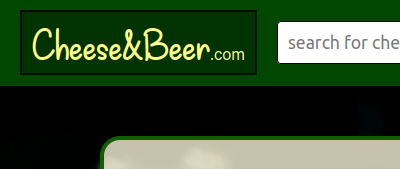

_" As soon as the user lands on the site their pathway should be clear and the options they are presented with need to make them stick"_\
From landing on the homepage a logged in user is 3 clicks from making a purchase. Every product listing on every page contains immediate options to purchase which lands them on the checkout page and most pages contain links back to where a user has come from so they will never be lost.  

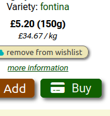

_"There is no need to re-invent the wheel with this site, in terms of how products are presented..."_\
The site takes strong influence from market leaders such as Amazon, and presents product listings in a clean and efficient way with no superfluous options or information.

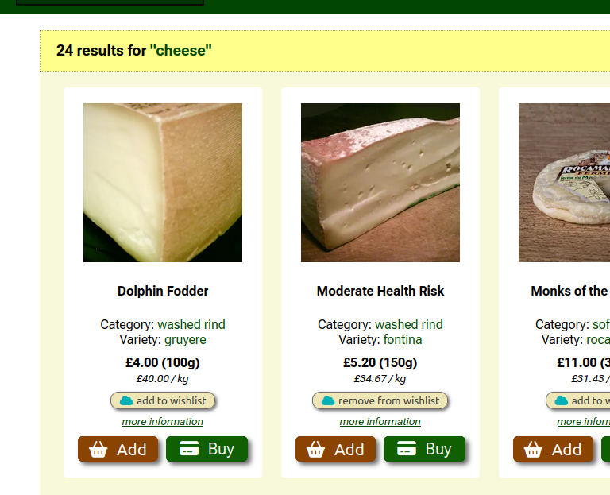

_"I think it's important that users aren't overwhelmed with menu options, especially on mobile..."_\
The menu layout is simple and obvious, and the search-bar is very prominent. All these options link directly into product listings so that users can get to what they want to see as quickly as possible.

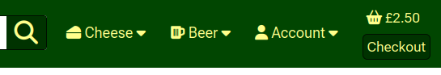

_"having novel and simple to use means of engagement... is key._\
The wishlist functionality is a really simple way for users to navigate the options available to them and save things to come back to later if they are short on time, helping to drive more purchases and reduce user frustration.

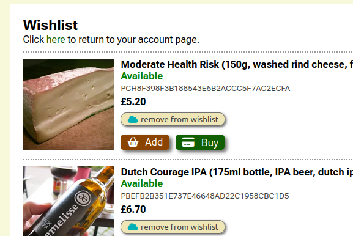

_" no features will be implemented that are not compliant with best practice, such as PCI DSS regulations..._\
Using Stripe instantly ensures that the site is compliant with best practice in handling sensitive user data.

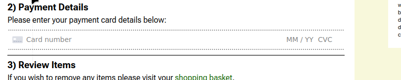

### Site Visitor User Stories
([back to top](#testing-documentation))

_"Users need to feel comfortable when they land on the site. Not like they are being overly sold to..."_\
The homepage introduction is more welcoming than sales oriented and establishes a tone for the site, and the homepage banners focus on providing an immediate pathway to browsing products rather than pushing particular items.

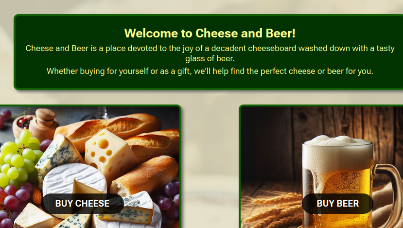

_"Once the user has landed on the homepage, they need a clear and obvious path to locate what it is they visited the site for in the first place."_\
It is immediately obvious to a user what they can expect to find within each of the menus, and the search bar provides instant, prominent access to finding exactly what they are looking for.  All of the menu options on landing deliver the user to product listings where they can view cheese and beer products.

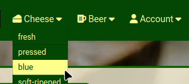

_"For users uninitiated in the world of cheese, it is important to have recommendations and suggestions, especially when it comes to pairing."_\
A key feature of the site is how categories of cheese and beer pair with each other to provide useful suggestions on the view product page, taking the user on a journey of discovery.

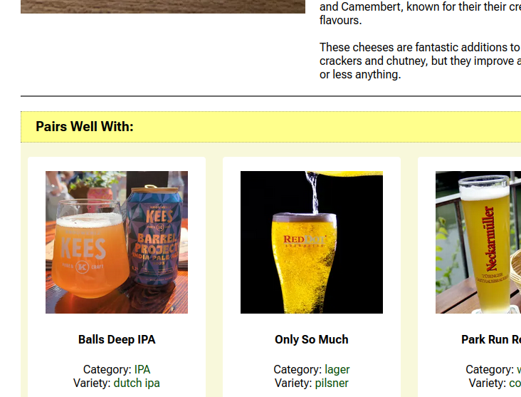

_"The user doesn't want to have to jump through a lot of hoops to do anything online, especially on mobile."_\
The checkout screen is instantly accessible via the buy now button, and the options for registered users to save and select addresses mean that all they need to do input is a card number.  Purchase buttons are in multiple locations and clearly sited so the user can easily perform the actions they want to.

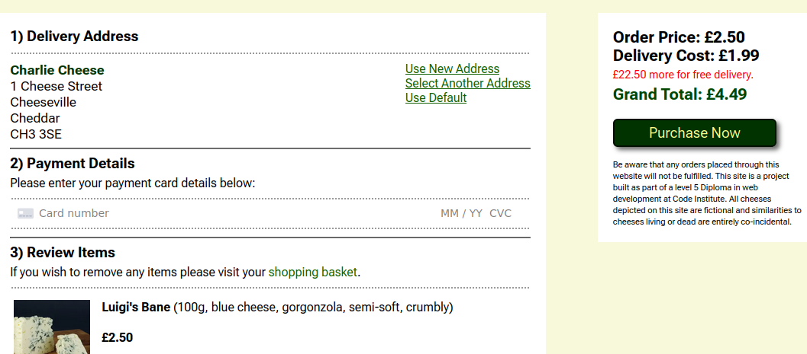

_"If a user is purchasing a gift it should be easy to add, select and save multiple delivery addresses."_\
Users are able to add new addresses or select existing ones directly from checkout, or choose to update them via the address management page.

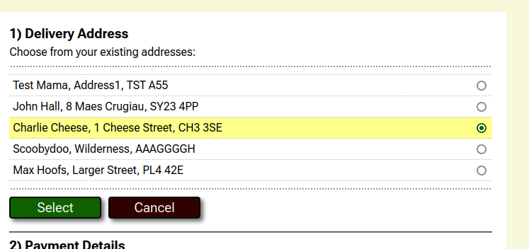

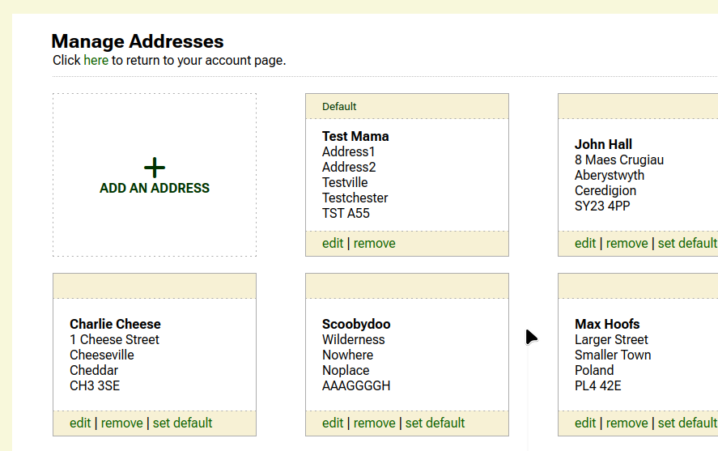

_"People are used to once click shopping with Amazon's buy it now, for example. Equally they also want to feel their data is protected..."_\
Users have access to buy now alerts wherever a product is listed, which makes for a slick and convenient checkout process. Unlike Amazon, where the buy now process can be confusing and disorientating and isn't available everywhere, Cheese and Beer provides concise alerts with clear options leading to a single checkout page, so the user always feels like they are in control of what is going on.

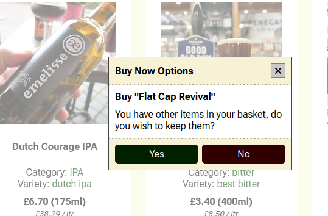

 _"Customers would like to be able to review and track their orders, especially if everything doesn't go to plan."_\
Users who are signed in can review all of their orders, and even unregisterd users can view an order if they have concise enough data, all of which is provided in the confirmation e-mails. Order views all link directly to a contact form which is pre-populated with customer details and that of the order they were viewing, and mail receipt confirmations assure them that their request has been recieved, and indeed can be viewed by a superuser via the admin console.

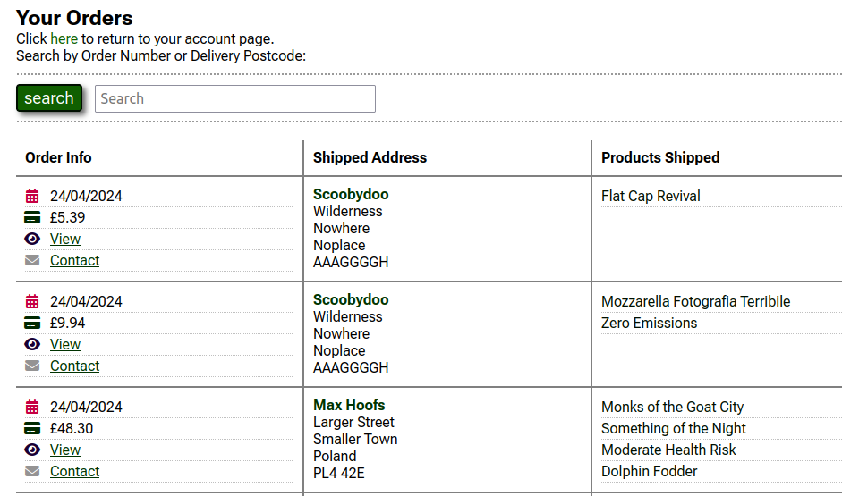

## Testing
([back to top](#testing-documentation))

### Automated Testing
([back to top](#testing-documentation))

During the course of the Django module we were shown how to use the testing feature and assess testing coverage.  I would have loved to implement it for this project, however on account of the size of the project and the timescales involved applying automated testing across the site would have taken too much time and resource to do properly.

With this in mind and the fact I have a well established manual testing process which I have applied successfully to my last two projects, I have decided to stick to manual testing on this occasion, and look into automated testing once the MVP has been completed.

### Manual Testing
([back to top](#testing-documentation))

#### Manually Testing Page Functionality

Although there are a total of 32 pages across the site, manual testing is still practical because many of them are very similar, and none of them are extremely complicated. As such my apporach will be to systematically check the functionality of every page against expected outcomes to ensure the site is working as intended, rather than go through every line of code, which will only be necessary if I find a major bug.

BASE TEMPLATE NAVIGATION:

| Feature Tested                        | Expected Outcome                 | Result  |
| ------------------------------------- | -------------------------------- | ------- |
| Cheese menu | on mousover or onclick (for mobile) returns drop-down list of cheese categories | Success |
| Cheese menu | mouseover highlights menu options correctly  | Success |
| Cheese menu | on clicking out of the menu the menu hides (mobile)  | Success |
| Cheese menu | each category returns product view with products in that category | Success |
| Beer menu | on mousover returns or onclick (for mobile)  drop-down list of beer categories | Success |
| Beer menu | mouseover highlights menu options correctly  | Success |
| Beer menu | on clicking out of the menu the menu hides (mobile)  | Success |
| Beer menu | each category returns product view with products in that category | Success |
| Account menu | on mousover returns appropriate drop-down list to user status | Success |
| Account menu | mouseover highlights menu options correctly  | Success |
| Account menu | on clicking out of the menu the menu hides (mobile)  | Success |
| Account menu | all menu options return the correct page | Success |
| Main Search | mouseover or on-click effects on search button work correctly | Success |
| Main Search | on entering a search term the product view is returned with appropriate results | Success |
| Main Search | if no search term is entered the product view is returned with all products dispayed | Success |
| Logo banner | returns the user to the homepage | Success |
| Checkout button | only visible if the user has something in their basket | Success |
| Checkout button | mouseover/active effects work as intented | Success |
| Checkout button | on click takes user directly to checkout page | Success |
| Basket section | only visible if the user has something in their basket | Success |
| Basket section | mouseover/active effects work as intented | Success |
| Basket section | on click takes user directly their basket of goods | Success |

HOME PAGE:

| Feature Tested                        | Expected Outcome                 | Result  |
| ------------------------------------- | -------------------------------- | ------- |
| DOM |	all page elements load as expected |	Success |
| DOM |	all interactable elements change on hover and show pointer | Success |
| Buy cheese button | returns product list view of all cheeses | Success |
| Buy beer button | returns product list view of all beers | Success |

FIND ORDER:

| Feature Tested                        | Expected Outcome                 | Result  |
| ------------------------------------- | -------------------------------- | ------- |
| DOM |	all page elements load as expected |	Success |
| DOM |	all interactable elements change on hover and show pointer | Success |
| Input fields | highlight correctly when focussed | Success |
| Form element | form will not submit unless all fields correctly filled out | Success |
| Form element | accurately filled out form returns specific order items | Success |

404 PAGE

| Feature Tested                        | Expected Outcome                 | Result  |
| ------------------------------------- | -------------------------------- | ------- |
| DOM |	all page elements load as expected |	Success |
| DOM |	all interactable elements change on hover and show pointer | Success |
| DOM |	page loads correctly whenever an invalid url is entered | Success |
| Life goals button | Returns product view with a list of all cheeses  | Success |

PRODUCTS LIST PAGE AND SEARCH

| Feature Tested                        | Expected Outcome                 | Result  |
| ------------------------------------- | -------------------------------- | ------- |
| DOM |	all page elements load as expected |	Success |
| DOM |	all interactable elements change on hover and show pointer | Success |
| Initial Sorting |	Products initially sorted by most recently added |	Success |
| Search Text |	Correctly displays the search results |	Success |
| Sort by Price Filter (low-high) | Orders products from the cheapest by weight/volume to the most expensive |	Success |
| Sort by Price Filter (high-low) | Orders products from the most expensive by weight/volume to the cheapest |	Success |
| Sort by Most Popular | Orders products by the most units sold |	Success |
| Category Link | returns product list page with all products in category |	Success |
| Variety Link | link returns product list page with all products containing that variety |	Success |
| Product Image | clicking the product image returns the product detail view for that product | Success |
| Product Name | clicking the product name returns the product detail view for that product | Success |
| More information | clicking returns the product detail view for that product | Success |
| Add to wishlist | successfully adds the product to the wishlist for that user, re-loads with remove from wishlist button | Success |
| Remove from wishlist | successfully adds the product to the wishlist for that user, re-loads with add to wishlist button | Success |
| Add button | successfully adds product to basket, activates appropriate notification | Success |
| Buy button (no items in basket) | adds item to basket, returns user to checkout page, triggers appropriate notification | Success |
| Buy button (items in basket) | successfully triggers a buy now notification for the product if items are in basket | Success |
| Buy notification ('no') | returns user to checkout page with just that item in basket, returns appropriate notification | Success |
| Buy notification ('yes') | returns user to checkout page adding the item to the basket, returns appropriate notification | Success |
| Buy notification ('yes') | returns user to checkout page adding the item to the basket, returns appropriate notification | Success |

VIEW PRODUCT

| Feature Tested                        | Expected Outcome                 | Result  |
| ------------------------------------- | -------------------------------- | ------- |
| DOM |	all page elements load as expected |	Success |
| DOM |	all interactable elements change on hover and show pointer | Success |
| Pairings sorted by Most Popular | Orders paired products by the most units sold |	Success |
| Pairing Category Link | returns product list page with all products in category |	Success |
| Pairing Variety Link | link returns product list page with all products containing that variety |	Success |
| Pairing Product Image | clicking the product image returns the product detail view for that product | Success |
| Pairing Product Name | clicking the product name returns the product detail view for that product | Success |
| Pairing More information | clicking returns the product detail view for that product | Success |
| Pairing Add to wishlist | successfully adds the product to the wishlist for that user, re-loads with remove from wishlist button | Success |
| Pairing Remove from wishlist | successfully adds the product to the wishlist for that user, re-loads with add to wishlist button | Success |
| Pairing Add button | successfully adds product to basket, activates appropriate notification | Success |
| Pairing Buy button (no items in basket) | adds item to basket, returns user to checkout page, triggers appropriate notification | Success |
| Pairing Buy button (items in basket) | successfully triggers a buy now notification for the product if items are in basket | Success |
| Pairing Buy notification ('no') | returns user to checkout page with just that item in basket, returns appropriate notification | Success |
| Pairing Buy notification ('yes') | returns user to checkout page adding the item to the basket, returns appropriate notification | Success |
| Product Add button | successfully adds product to basket with correct quantity, activates appropriate notification | Success |
| Product Buy button (no items in basket) | adds item to basket with correct quantity, returns user to checkout page, triggers appropriate notification | Success |
| Product Buy button (items in basket) | successfully triggers a buy now notification for the product if items are in basket | Success |
| Product Buy notification ('no') | returns user to checkout page with just that item in basket in correct quantity, returns appropriate notification | Success |
| Product Buy notification ('yes') | returns user to checkout page adding the item to the basket in correct quantity, returns appropriate notification | Success |
| Product Add to wishlist | successfully adds the product to the wishlist for that user, re-loads with remove from wishlist button | Success |
| Product Remove from wishlist | successfully adds the product to the wishlist for that user, re-loads with add to wishlist button | Success |
| Product Quantity Plus | Increments quantity counter by 1, updates total | Success |
| Product Quantity Plus | Will not advance beyond 200 units | Success |
| Product Quantity Minus | Decrements quantity counter by 1, updates total | Success |
| Product Quantity Minus | Will not decrease below 1 | Success |
| Product Quantity Box manual entry | updates total with appropriate value to number typed | Success |
| Product Remove from wishlist | successfully adds the product to the wishlist for that user, re-loads with add to wishlist button | Success |
| Product Quantity Limited | If a number is entered below 1 or above 200 buttons disapled and notification displayed | Success |
| Product Buttons re-enabled | If a number beyond the threshold is adjusted below it, buttons re-enabled | Success |

CHECKOUT

| Feature Tested                        | Expected Outcome                 | Result  |
| ------------------------------------- | -------------------------------- | ------- |
| DOM |	all page elements load as expected |	Success |
| DOM |	all interactable elements change on hover and show pointer | Success |
| Address Form | displayed if user is not logged in along with sign-up / sign-in links | Success |
| Address Form Validation | JavaScript validation prevents form submission unless address correctly filled out | Success |
| Credit card validation | JavaScript validation prevents form submission unless stripe element correctly filled out | Success |
| Sign in link | returns user to sign-in page | Success |
| Sign up link | returns user to sign-up page | Success |
| Quantity plus | adds another unit of item to basket, returns appropriate notification | Success |
| Quantity minus | removes a unit item to basket unless there is only 1 unit remaining, returns appropriate notification | Success |
| Quantity minus disable | disables minus button when quantity is 1 | Success |
| Quantity minus re-enable | enables minus button when quantity climbs above | Success |
| Purchase Now | Submits form when all fields correctly filled out and returns user to confirmation page | Success |
| New user loggin in checkout | User with no addresses shown form to add new address | Success |
| New user address form | will not submit unless correctly filled out | Success |
| New user address form | on submission returns user to checkout with address listed in address section | Success |
| New user address form | on submission first address automatically set to default | Success |
| Address-prepopulation | the selected user address pre-populates the checkout address field | Success |
| Address options | display the correct options depending on the address status | Success |
| Use new address llink | displays address form for existing user to add a new address | Success |
| Address add cancel button | returns user to checkout | Success |
| Select another address link | opens address selector to select another address | Success |
| Address selector | correctly highlights selected address and adjusts if clicked on | Success |
| Address selector select button | selects current address for order, returns to checkout view with correct address populated | Success |
| Address selector cancel button | returns to checkout view with no changes to previously selected address | Success |
| Use Default link | changes selected address to default, re-loads checkout page | Success |
| Form submission | on correctly entering card details, form submits with selected address correctly populating order form and returns user to conformation page | Success |
| On submission | order table populated appropriately | Success |
| On submission | orderItems table populated appropriately | Success |
| On submission (if order not created) | webhook handler creates order appropriately | Success |
| On submission (if order not created) | re-visiting checkout page clears order session objects and returns user to homepage with appropriate message | Success |
| On submission | webhook handler sends confirmation e-mail to user | Success |

CHECKOUT CONFIRMATION

| Feature Tested                        | Expected Outcome                 | Result  |
| ------------------------------------- | -------------------------------- | ------- |
| DOM |	all page elements load as expected |	Success |
| DOM |	all interactable elements change on hover and show pointer | Success |
| Order Link | link redirects user to the order they have just submitted | Success |
| Order e-mail | the checkout page displays the correct e-mail address  | Success |
| e-mail confirmation | the user receives e-mail confirmation of their order  | Success |

BASKET REVIEW

| Feature Tested                        | Expected Outcome                 | Result  |
| ------------------------------------- | -------------------------------- | ------- |
| DOM |	all page elements load as expected |	Success |
| DOM |	all interactable elements change on hover and show pointer | Success |
| Product Image | clicking the product image returns the product detail view for that product | Success |
| Product Name | clicking the product name returns the product detail view for that product | Success |
| Quantity plus | adds another unit of item to basket, returns appropriate notification | Success |
| Quantity minus | removes a unit item to basket unless there is only 1 unit remaining, returns appropriate notification | Success |
| Quantity minus disable | disables minus button when quantity is 1 | Success |
| Quantity minus re-enable | enables minus button when quantity climbs above | Success |
| remove link | removes item from basket, returning basket notification on same page if there are still produts remaining, or returning to homepage with message if the action empties the basket | Success |
| Go to Checkout buttons | both return user to checkout page | Success |

LOGIN

| Feature Tested                        | Expected Outcome                 | Result  |
| ------------------------------------- | -------------------------------- | ------- |
| DOM |	all page elements load as expected |	Success |
| DOM |	all interactable elements change on hover and show pointer | Success |
| Input elements | display as expected on focus | Success |
| Sign up link | retuns user to sign-up page | Success |
| Reset password link | retuns user to reset password page | Success |
| Submit button | submits form when correctly filled out, logs user in and returns to homepage if successful| Success |

SIGNUP

| Feature Tested                        | Expected Outcome                 | Result  |
| ------------------------------------- | -------------------------------- | ------- |
| DOM |	all page elements load as expected |	Success |
| DOM |	all interactable elements change on hover and show pointer | Success |
| Input elements | display as expected on focus | Success |
| Sign in link | retuns user to sign-in page | Success |
| Reset password link | retuns user to reset password page | Success |
| Submit button | submits form when correctly filled out, logs user in and returns to homepage if successful | Success |
| On submission | user table populated appropriately and username populated with e-mail address | Success |

PASSWORD RESET

| Feature Tested                        | Expected Outcome                 | Result  |
| ------------------------------------- | -------------------------------- | ------- |
| DOM |	all page elements load as expected |	Success |
| DOM |	all interactable elements change on hover and show pointer | Success |
| Input element | displays as expected on focus | Success |
| Submit button | submits form when correctly filled out, returns user to password reset done page | Success |

PASSWORD RESET EMAIL DONE

| Feature Tested                        | Expected Outcome                 | Result  |
| ------------------------------------- | -------------------------------- | ------- |
| DOM |	all page elements load as expected |	Success |
| DOM |	all interactable elements change on hover and show pointer | Success |
| Reset password link | retuns user to reset password page | Success |
| Buy cheese link | returns product list view of all cheeses | Success |
| Buy beer link | returns product list view of all beers | Success |
| reset e-mail | reset e-mail is successfull sent to the provided e-mail if it exists | Success |

PASSWORD RESET FROM KEY

| Feature Tested                        | Expected Outcome                 | Result  |
| ------------------------------------- | -------------------------------- | ------- |
| DOM |	all page elements load as expected |	Success |
| DOM |	all interactable elements change on hover and show pointer | Success |
| Input elements | display as expected on focus | Success ||
| Submit button | submits form when passwords correctly filled out and match, returns user to reset done page | Success |

PASSWORD RESET FROM KEY DONE

| Feature Tested                        | Expected Outcome                 | Result  |
| ------------------------------------- | -------------------------------- | ------- |
| DOM |	all page elements load as expected |	Success |
| DOM |	all interactable elements change on hover and show pointer | Success |
| Buy cheese link | returns product list view of all cheeses | Success |
| Buy beer link | returns product list view of all beers | Success |

MY ACCOUNT

| Feature Tested                        | Expected Outcome                 | Result  |
| ------------------------------------- | -------------------------------- | ------- |
| DOM |	all page elements load as expected |	Success |
| DOM |	all interactable elements change on hover and show pointer | Success |
| Manage addresses link | returns manage addresses page | Success |
| View orders link | returns view orders page | Success |
| View wishlist link | returns view wishlist page | Success |
| Change password link | returns reset password page | Success |
| Contact Us link | returns contact form page page | Success |
| Log out link | logs a user out | Success |

MANAGE ADDRESSES

| Feature Tested                        | Expected Outcome                 | Result  |
| ------------------------------------- | -------------------------------- | ------- |
| DOM |	all page elements load as expected |	Success |
| DOM |	all interactable elements change on hover and show pointer | Success |
| Account page link | returns user to the account page | Success |
| Add an address button | returns add address form | Success |
| Edit link | returns edit address page pre-populated with the correct address | Success |
| remove link | opens remove address confirmation alerd | Success |
| alert no button | closes the alert and reverts the page to the original state | Success |
| alert yes button | deletes the address.  If the address was default, the default address reverts to the first address added | Success |
| set default link | sets the selected address to default, re-loads the page | Success |

ADD AN ADDRESS

| Feature Tested                        | Expected Outcome                 | Result  |
| ------------------------------------- | -------------------------------- | ------- |
| DOM |	all page elements load as expected |	Success |
| DOM |	all interactable elements change on hover and show pointer | Success |
| Manage addresses link | returns user to the manage addresses page | Success |
| Input elements | display as expected on focus | Success |
| Submit button | submits form only when correctly filled out, returns user to address page with success message| Success |
| set default checkbox | sets the new address to default if checked | Success |
| postcode | capitalized once it has been submitted if previously in lower case | success |
| On submission | addresses table populated appropriately | Success |

EDIT AN ADDRESS

| Feature Tested                        | Expected Outcome                 | Result  |
| ------------------------------------- | -------------------------------- | ------- |
| DOM |	all page elements load as expected | Success |
| DOM |	all interactable elements change on hover and show pointer | Success |
| Manage addresses link | returns user to the manage addresses page | Success |
| Input elements | display as expected on focus | Success |
| Submit button | submits form only when correctly filled out, returns user to address page with success message | Success |
| set default checkbox | sets the address to default if checked | Success |
| postcode | capitalized once it has been submitted if previously in lower case | success |
| On submission | addresses table populated appropriately | Success |

ORDERS PAGE

| Feature Tested                        | Expected Outcome                 | Result  |
| ------------------------------------- | -------------------------------- | ------- |
| DOM |	all page elements load as expected |	Success |
| DOM |	all interactable elements change on hover and show pointer | Success |
| Order View | If no orders have been made appropriate message is displayed | Success |
| Search input element | displays as expected on focus | Success |
| Account page link | returns user to the account page | Success |
| Order search button | returns page with error message if input not filled out | Success |
| Order search button | returns appropriate results when filled out as instructed | Success |
| Order search button | if no results found appropriate message displayed | Success |
| View link | takes user to order items view for selected order | Success |
| Contact link | opens contact form page, with form pre-populated according to the order and logged in user | Success |
| Products list | clicking the product name takes user to the product view page | Success |

VIEW ORDER INFO

| Feature Tested                        | Expected Outcome                 | Result  |
| ------------------------------------- | -------------------------------- | ------- |
| DOM |	all page elements load as expected |	Success |
| DOM |	all interactable elements change on hover and show pointer | Success |
| Contact link | opens contact form page, with form pre-populated according to the order and logged in user | Success |
| Product Image | clicking the product image returns the product detail view for that product | Success |
| Product Name | clicking the product name returns the product detail view for that product | Success |
| Product Buy Again button (no items in basket) | adds item to basket, returns user to checkout page, triggers appropriate notification | Success |
| Product Buy Again button (items in basket) | successfully triggers a buy now notification for the product if items are in basket | Success |
| Product Buy notification ('no') | returns user to checkout page with just that item in basket, returns appropriate notification | Success |
| Product Buy notification ('yes') | returns user to checkout page adding the item to the basket, returns appropriate notification | Success |
| View another order button| returns user to orders page | Success |

VIEW WISHLIST

| Feature Tested                        | Expected Outcome                 | Result  |
| ------------------------------------- | -------------------------------- | ------- |
| DOM |	all page elements load as expected |	Success |
| DOM |	all interactable elements change on hover and show pointer | Success |
| Account page link | returns user to the account page | Success |
| Product Image | clicking the product image returns the product detail view for that product | Success |
| Product Name | clicking the product name returns the product detail view for that product | Success |
| Product Add button | successfully adds product to basket, activates appropriate notification | Success |
| Product Buy button (no items in basket) | adds item to basket, returns user to checkout page, triggers appropriate notification | Success |
| Product Buy button (items in basket) | successfully triggers a buy now notification for the product if items are in basket | Success |
| Product Buy notification ('no') | returns user to checkout page with just that item in basket, returns appropriate notification | Success |
| Product Buy notification ('yes') | returns user to checkout page adding the item to the basket, returns appropriate notification | Success |
| Product Add to wishlist | successfully adds the product to the wishlist for that user, re-loads with remove from wishlist button | Success |
| Product Remove from wishlist | successfully adds the product to the wishlist for that user, re-loads with add to wishlist button | Success |

CONTACT US

| Feature Tested                        | Expected Outcome                 | Result  |
| ------------------------------------- | -------------------------------- | ------- |
| DOM |	all page elements load as expected |	Success |
| DOM |	all interactable elements change on hover and show pointer | Success |
| DOM | contact form is correctly pre-populated based on point of origin and user | Success |
| Account page link | returns user to the account page | Success |
| Input elements | display as expected on focus | Success |
| Submit button | submits form only when correctly filled out, returns user to contact confirmation page | Success |
| On submission | ContactForm table populated appropriately | Success |

CONTACT US CONFIRMATION

| Feature Tested                        | Expected Outcome                 | Result  |
| ------------------------------------- | -------------------------------- | ------- |
| DOM |	all page elements load as expected |	Success |
| DOM |	all interactable elements change on hover and show pointer | Success |
| DOM | contact form is correctly pre-populated based on point of origin and user | Success |
| Account page link | returns user to the account page | Success |
| Confirmation e-mail | confirmation e-mail received | Success |

ADMIN CONSOLE

| Feature Tested                        | Expected Outcome                 | Result  |
| ------------------------------------- | -------------------------------- | ------- |
| DOM |	all page elements load as expected |	Success |
| DOM |	all interactable elements change on hover and show pointer | Success |
| Add cheese category link | takes user to the add cheese category page | Success |
| Add beer category link | takes user to the add beer category page | Success |
| Edit categories link | takes user to the edit categories page | Success |
| Add cheese link | takes user to the add cheese page | Success |
| Add beer link | takes user to the add beer page | Success |
| Edit products link | takes user to the edit products page | Success |
| View request link | takes user to the view messages page | Success |
| Back to Homepage | returns user to the homepage | Success |

ADD CHEESE CATEGORY

| Feature Tested                        | Expected Outcome                 | Result  |
| ------------------------------------- | -------------------------------- | ------- |
| DOM |	all page elements load as expected |	Success |
| DOM |	all interactable elements change on hover and show pointer | Success |
| Back to product admin link | returns user to the admin console page | Success |
| Input elements | display as expected on focus | Success |
| Add image field | displays preview of image when image uploaded | Success |
| Cancel upload field | removes uploaded image and preview | Success |
| page refresh | any uploaded images cleared | Success |
| Submit button | submits form when correctly filled out, returns user to admin console with success message | Success |
| On submission | cheese category table populated successfully | Success |

ADD BEER CATEGORY

| Feature Tested                        | Expected Outcome                 | Result  |
| ------------------------------------- | -------------------------------- | ------- |
| DOM |	all page elements load as expected |	Success |
| DOM |	all interactable elements change on hover and show pointer | Success |
| Back to product admin link | returns user to the admin console page | Success |
| Input elements | display as expected on focus | Success |
| Add image field | displays preview of image when image uploaded | Success |
| Cancel upload field | removes uploaded image and preview | Success |
| Page refresh | any uploaded images cleared | Success |
| Submit button | submits form when correctly filled out, returns user to admin console with success message | Success |
| On submission | beer category table populated successfully | Success |

EDIT CATEGORIES

| Feature Tested                        | Expected Outcome                 | Result  |
| ------------------------------------- | -------------------------------- | ------- |
| DOM |	all page elements load as expected |	Success |
| DOM |	all interactable elements change on hover and show pointer | Success |
| Back to product admin link | returns user to the admin console page | Success |
| Edit Cheese category icons | Opens form to edit the correct cheese category | Success |
| Edit Beer category icons | Opens form to edit the correct beer category | Success |

EDIT CHEESE CATEGORY

| Feature Tested                        | Expected Outcome                 | Result  |
| ------------------------------------- | -------------------------------- | ------- |
| DOM |	all page elements load as expected |	Success |
| DOM |	all interactable elements change on hover and show pointer | Success |
| DOM | form fields populated correctly | Success |
| Back to product admin link | returns user to the admin console page | Success |
| Back to edit category link | returns user to the edit category page | Success |
| Input elements | display as expected on focus | Success |
| Add image field | replaces current image with preview of new image when image uploaded | Success |
| Cancel upload field | removes uploaded image and preview and displays the existing image | Success |
| Pairing selector buttons | selecting or deselecting the buttons appropriately populates the relevant form field | Success |
| Page refresh | any uploaded images cleared and existing image displayed | Success |
| Submit button | submits form when correctly filled out, returns user to admin console with success message | Success |
| On submission | cheese category table and related many-to-many table updated successfully | Success |

EDIT BEER CATEGORY

| Feature Tested                        | Expected Outcome                 | Result  |
| ------------------------------------- | -------------------------------- | ------- |
| DOM |	all page elements load as expected |	Success |
| DOM |	all interactable elements change on hover and show pointer | Success |
| DOM | form fields populated correctly | Success |
| Back to product admin link | returns user to the admin console page | Success |
| Back to edit category link | returns user to the edit category page | Success |
| Input elements | display as expected on focus | Success |
| Add image field | replaces current image with preview of new image when image uploaded | Success |
| Cancel upload field | removes uploaded image and preview and displays the existing image | Success |
| Pairing selector buttons | selecting or deselecting the buttons appropriately populates the relevant form field | Success |
| Page refresh | any uploaded images cleared and existing image displayed | Success |
| Submit button | submits form when correctly filled out, returns user to admin console with success message | Success |
| On submission | beer category table and related many-to-many table updated successfully | Success |

ADD BEER

| Feature Tested                        | Expected Outcome                 | Result  |
| ------------------------------------- | -------------------------------- | ------- |
| DOM |	all page elements load as expected |	Success |
| DOM |	all interactable elements change on hover and show pointer | Success |
| Back to product admin link | returns user to the admin console page | Success |
| Input elements | display as expected on focus | Success |
| Add image field | displays preview of image when image uploaded | Success |
| Cancel upload field | removes uploaded image and preview | Success |
| Page refresh | any uploaded images cleared | Success |
| Submit button | submits form when correctly filled out, returns user to admin console with success message | Success |
| On submission | product table updated successfully | Success |
| On submission | description populated with the description of the selected category if field left blank | Success |
| On submission | image_url populated with the description of the selected category if field left blank | Success |

ADD CHEESE

| Feature Tested                        | Expected Outcome                 | Result  |
| ------------------------------------- | -------------------------------- | ------- |
| DOM |	all page elements load as expected |	Success |
| DOM |	all interactable elements change on hover and show pointer | Success |
| Back to product admin link | returns user to the admin console page | Success |
| Input elements | display as expected on focus | Success |
| Add image field | displays preview of image when image uploaded | Success |
| Cancel upload field | removes uploaded image and preview | Success |
| Page refresh | any uploaded images cleared | Success |
| Submit button | submits form when correctly filled out, returns user to admin console with success message | Success |
| On submission | product table updated successfully | Success |
| On submission | description populated with the description of the selected category if field left blank | Success |
| On submission | image_url populated with the description of the selected category if field left blank | Success |

EDIT EXISTING PRODUCT

| Feature Tested                        | Expected Outcome                 | Result  |
| ------------------------------------- | -------------------------------- | ------- |
| DOM |	all page elements load as expected |	Success |
| DOM |	all interactable elements change on hover and show pointer | Success |
| Back to product admin link | returns user to the admin console page | Success |
| Search input element | display as expected on focus | Success |
| Product search button | returns all products if search field left blank | Success |
| Product search button | returns appropriate results when filled out as instructed | Success |
| Product search button | if no results found appropriate message displayed | Success |
| Edit icon link | takes user to the correct product edit page | Success |
| Delete icon link | only displays if a product has sold zero units | Success |
| Delete icon link | opens delete alert to confirm product deletion | Success |
| Delete alert 'no' | closes alert and reverts page to original state | Success |
| Delete alert 'yes' | deletes product and cascades to other relevant models | Success |

PRODUCT EDIT PAGE

| Feature Tested                        | Expected Outcome                 | Result  |
| ------------------------------------- | -------------------------------- | ------- |
| DOM |	all page elements load as expected |	Success |
| DOM |	all interactable elements change on hover and show pointer | Success |
| DOM | correct form fields are loaded for the product type and the right product populates the page | Success |
| Back to product admin link | returns user to the admin console page | Success |
| back to edit products page | returns user to edit products page | Success |
| Product availability button (on) | When clicked sets product availability to False, reloads the page and displays off button state | Success |
| Product availability button (off) | When clicked sets product availability to True, reloads the page and displays on button state | Success |
| Input elements | display as expected on focus | Success |
| Add image field | displays preview of image when image uploaded | Success |
| Cancel upload field | removes uploaded image and preview | Success |
| Page refresh | any uploaded images cleared | Success |
| Submit button | submits form when correctly filled out, returns user to admin console with success message | Success |
| On submission | product table updated successfully | Success |
| On submission | description populated with the description of the selected category if field left blank | Success |
| On submission | image_url populated with the description of the selected category if field left blank | Success |

VIEW CUSTOMER MESSAGES

| Feature Tested                        | Expected Outcome                 | Result  |
| ------------------------------------- | -------------------------------- | ------- |
| DOM |	all page elements load as expected |	Success |
| DOM |	all interactable elements change on hover and show pointer | Success |
| Back to product admin link | returns user to the admin console page | Success |
| Delete icon link | opens delete alert to confirm message deletion | Success |
| Delete alert 'no' | closes alert and reverts page to original state | Success |
| Delete alert 'yes' | deletes message from database and returns user to view messages page with success message | Success |
| View icon link | opens order view page for the order number linked to the message | Success |

#### Issues found during manual testing

The manual testing process uncovered a few issues, none of which were serious and all of which were easily fixed.

 - The majority of buttons site-wide did not display the pointer on mouse element, so I needed to add the appropriate helper class to them all.
 - The Account menu header was nested in a span rather than a div which meant it wasn't takig up all the space it was supposed to and proved hard to click on.  This was rectified by updating how the elements were nested.
 - Found issue in checkout and basket pages where decremening the amount when it was on 1 unit still triggered a notification.  Wrote some javascript to disable the button on that amount.
 - The contact confirmation page had not been validated, and showed a few errors which I swifly resolved.

#### Responsiveness Testing

I have tested at (in descending order) 3072px, 1920px (default), 1200px, 920px, 650px, 450px, 360px, 320px.  This is reflective of the major break points.  Keep in mind my testing of the larger screen size is unreliable on account of the fact I have a standard HD monitor and changing the zoom doesn't reflect what a user sees in reality on a 4k monitor, unless it is enormous.  For example, although the Samsung Galaxy S8 is rated as a 360px display due to its size, its screen resolution is actually a lot higher, at 1440px.  Obviously you wouldn't test an S8 on that screen size!

As well as using google developer tools in responsive mode, this project has been tested in the real world on Chrome and Firefox in Windows on a 1920 x 1080 HD monitor, and on a Samsung Galaxy S8 (at c.360px width).

| Page tested | Screen width tested | Result |
| ------------- | ------------------|-------------- |
| home page | 3072px | Success |
| home page | 1920px | Success |
| home page | 1200px | Success |
| home page | 920px | Success |
| home page | 650px | Success |
| home page | 450px | Success |
| home page | 360px | Success |
| home page | 320px | Success |
| find order page | 3072px | Success |
| find order page | 1920px | Success |
| find order page | 1200px | Success |
| find order page | 920px | Success |
| find order page | 650px | Success |
| find order page | 450px | Success |
| find order page | 360px | Success |
| find order page | 320px | Success |
| 404 page | 3072px | Success |
| 404 page | 1920px | Success |
| 404 page | 1200px | Success |
| 404 page | 920px | Success |
| 404 page | 650px | Success |
| 404 page | 450px | Success |
| 404 page | 360px | Success |
| 404 page | 320px | Success |
| products list page | 3072px | Success |
| products list page | 1920px | Success |
| products list page | 1200px | Success |
| products list page | 920px | Success |
| products list page | 650px | Success |
| products list page | 450px | Success |
| products list page | 360px | Success |
| products list page | 320px | Success |
| view product page | 3072px | Success |
| view product page | 1920px | Success |
| view product page | 1200px | Success |
| view product page | 920px | Success |
| view product page | 650px | Success |
| view product page | 450px | Success |
| view product page | 360px | Success |
| view product page | 320px | Success |
| checkout page | 3072px | Success |
| checkout page | 1920px | Success |
| checkout page | 1200px | Success |
| checkout page | 920px | Success |
| checkout page | 650px | Success |
| checkout page | 450px | Success |
| checkout page | 360px | Success |
| checkout page | 320px | Success |
| checkout confirmation page | 3072px | Success |
| checkout confirmation page | 1920px | Success |
| checkout confirmation page | 1200px | Success |
| checkout confirmation page | 920px | Success |
| checkout confirmation page | 650px | Success |
| checkout confirmation page | 450px | Success |
| checkout confirmation page | 360px | Success |
| checkout confirmation page | 320px | Success |
| basket review page | 3072px | Success |
| basket review page | 1920px | Success |
| basket review page | 1200px | Success |
| basket review page | 920px | Success |
| basket review page | 650px | Success |
| basket review page | 450px | Success |
| basket review page | 360px | Success |
| basket review page | 320px | Success |
| login page | 3072px | Success |
| login page | 1920px | Success |
| login page | 1200px | Success |
| login page | 920px | Success |
| login page | 650px | Success |
| login page | 450px | Success |
| login page | 360px | Success |
| login page | 320px | Success |
| signup page | 3072px | Success |
| signup page | 1920px | Success |
| signup page | 1200px | Success |
| signup page | 920px | Success |
| signup page | 650px | Success |
| signup page | 450px | Success |
| signup page | 360px | Success |
| signup page | 320px | Success |
| password reset page | 3072px | Success |
| password reset page | 1920px | Success |
| password reset page | 1200px | Success |
| password reset page | 920px | Success |
| password reset page | 650px | Success |
| password reset page | 450px | Success |
| password reset page | 360px | Success |
| password reset page | 320px | Success |
| password reset email done page | 3072px | Success |
| password reset email done page | 1920px | Success |
| password reset email done page | 1200px | Success |
| password reset email done page | 920px | Success |
| password reset email done page | 650px | Success |
| password reset email done page | 450px | Success |
| password reset email done page | 360px | Success |
| password reset email done page | 320px | Success |
| password reset from key page | 3072px | Success |
| password reset from key page | 1920px | Success |
| password reset from key page | 1200px | Success |
| password reset from key page | 920px | Success |
| password reset from key page | 650px | Success |
| password reset from key page | 450px | Success |
| password reset from key page | 360px | Success |
| password reset from key page | 320px | Success |
| password reset from key done page | 3072px | Success |
| password reset from key done page | 1920px | Success |
| password reset from key done page | 1200px | Success |
| password reset from key done page | 920px | Success |
| password reset from key done page | 650px | Success |
| password reset from key done page | 450px | Success |
| password reset from key done page | 360px | Success |
| password reset from key done page | 320px | Success |
| my account page | 3072px | Success |
| my account page | 1920px | Success |
| my account page | 1200px | Success |
| my account page | 920px | Success |
| my account page | 650px | Success |
| my account page | 450px | Success |
| my account page | 360px | Success |
| my account page | 320px | Success |
| manage addresses page | 3072px | Success |
| manage addresses page | 1920px | Success |
| manage addresses page | 1200px | Success |
| manage addresses page | 920px | Success |
| manage addresses page | 650px | Success |
| manage addresses page | 450px | Success |
| manage addresses page | 360px | Success |
| manage addresses page | 320px | Success |
| add address page | 3072px | Success |
| add address page | 1920px | Success |
| add address page | 1200px | Success |
| add address page | 920px | Success |
| add address page | 650px | Success |
| add address page | 450px | Success |
| add address page | 360px | Success |
| add address page | 320px | Success |
| edit address page | 3072px | Success |
| edit address page | 1920px | Success |
| edit address page | 1200px | Success |
| edit address page | 920px | Success |
| edit address page | 650px | Success |
| edit address page | 450px | Success |
| edit address page | 360px | Success |
| edit address page | 320px | Success |
| orders page | 3072px | Success |
| orders page | 1920px | Success |
| orders page | 1200px | Success |
| orders page | 920px | Success |
| orders page | 650px | Success |
| orders page | 450px | Success |
| orders page | 360px | Success |
| orders page | 320px | Success |
| view order info page | 3072px | Success |
| view order info page | 1920px | Success |
| view order info page | 1200px | Success |
| view order info page | 920px | Success |
| view order info page | 650px | Success |
| view order info page | 450px | Success |
| view order info page | 360px | Success |
| view order info page | 320px | Success |
| view wishlist page | 3072px | Success |
| view wishlist page | 1920px | Success |
| view wishlist page | 1200px | Success |
| view wishlist page | 920px | Success |
| view wishlist page | 650px | Success |
| view wishlist page | 450px | Success |
| view wishlist page | 360px | Success |
| view wishlist page | 320px | Success |
| contact us page | 3072px | Success |
| contact us page | 1920px | Success |
| contact us page | 1200px | Success |
| contact us page | 920px | Success |
| contact us page | 650px | Success |
| contact us page | 450px | Success |
| contact us page | 360px | Success |
| contact us page | 320px | Success |
| contact us confirmation page | 3072px | Success |
| contact us confirmation page | 1920px | Success |
| contact us confirmation page | 1200px | Success |
| contact us confirmation page | 920px | Success |
| contact us confirmation page | 650px | Success |
| contact us confirmation page | 450px | Success |
| contact us confirmation page | 360px | Success |
| contact us confirmation page | 320px | Success |
| admin console page | 3072px | Success |
| admin console page | 1920px | Success |
| admin console page | 1200px | Success |
| admin console page | 920px | Success |
| admin console page | 650px | Success |
| admin console page | 450px | Success |
| admin console page | 360px | Success |
| admin console page | 320px | Success |
| add cheese category page | 3072px | Success |
| add cheese category page | 1920px | Success |
| add cheese category page | 1200px | Success |
| add cheese category page | 920px | Success |
| add cheese category page | 650px | Success |
| add cheese category page | 450px | Success |
| add cheese category page | 360px | Success |
| add cheese category page | 320px | Success |
| add beer category page | 3072px | Success |
| add beer category page | 1920px | Success |
| add beer category page | 1200px | Success |
| add beer category page | 920px | Success |
| add beer category page | 650px | Success |
| add beer category page | 450px | Success |
| add beer category page | 360px | Success |
| add beer category page | 320px | Success |
| edit categories page | 3072px | Success |
| edit categories page | 1920px | Success |
| edit categories page | 1200px | Success |
| edit categories page | 920px | Success |
| edit categories page | 650px | Success |
| edit categories page | 450px | Success |
| edit categories page | 360px | Success |
| edit categories page | 320px | Success |
| edit cheese category page | 3072px | Success |
| edit cheese category page | 1920px | Success |
| edit cheese category page | 1200px | Success |
| edit cheese category page | 920px | Success |
| edit cheese category page | 650px | Success |
| edit cheese category page | 450px | Success |
| edit cheese category page | 360px | Success |
| edit cheese category page | 320px | Success |
| edit beer category page | 3072px | Success |
| edit beer category page | 1920px | Success |
| edit beer category page | 1200px | Success |
| edit beer category page | 920px | Success |
| edit beer category page | 650px | Success |
| edit beer category page | 450px | Success |
| edit beer category page | 360px | Success |
| edit beer category page | 320px | Success |
| add beer page | 3072px | Success |
| add beer page | 1920px | Success |
| add beer page | 1200px | Success |
| add beer page | 920px | Success |
| add beer page | 650px | Success |
| add beer page | 450px | Success |
| add beer page | 360px | Success |
| add beer page | 320px | Success |
| add cheese page | 3072px | Success |
| add cheese page | 1920px | Success |
| add cheese page | 1200px | Success |
| add cheese page | 920px | Success |
| add cheese page | 650px | Success |
| add cheese page | 450px | Success |
| add cheese page | 360px | Success |
| add cheese page | 320px | Success |
| edit existing product page | 3072px | Success |
| edit existing product page | 1920px | Success |
| edit existing product page | 1200px | Success |
| edit existing product page | 920px | Success |
| edit existing product page | 650px | Success |
| edit existing product page | 450px | Success |
| edit existing product page | 360px | Success |
| edit existing product page | 320px | Success |
| product edit page | 3072px | Success |
| product edit page | 1920px | Success |
| product edit page | 1200px | Success |
| product edit page | 920px | Success |
| product edit page | 650px | Success |
| product edit page | 450px | Success |
| product edit page | 360px | Success |
| product edit page | 320px | Success |
| view customer messages page | 3072px | Success |
| view customer messages page | 1920px | Success |
| view customer messages page | 1200px | Success |
| view customer messages page | 920px | Success |
| view customer messages page | 650px | Success |
| view customer messages page | 450px | Success |
| view customer messages page | 360px | Success |
| view customer messages page | 320px | Success |

### Bugs and Issues
([back to top](#testing-documentation))

DEFAULT ADDRESS FORMATTING ISSUES:

I initially used dispaly: inline-block to display the address boxed on the 'manage addresses' page, and flexbox to arrange the content of the boxes.  I soon discovered that if I used templating logic (in this case to display which address was selected as default) it affected the layout of the page, offsetting the box containing the text injected by the template.  Equally bafflingly, if I removed the template logic and simply entered the text the problem went away.

Clues as to the solution became apparent when I noticed that changing the flex code within the first container (ie the add address container) similarly broke the flow of the page (the other boxes were all part of a for loop).  I struggled with this for a long while before eventually re-discovering the ability to wrap content within a flex container (which I haven't used for a couple of projects!) and switching the entire layout to flexbox.  I still have no clue what was causing these issues which seemed to be caused somehow by the code for the templating logic.  I think it might be whitespace-related as I gathered from my research that inline-block elements are susceptible to this, however as the code works perfectly with flexbox I have paid it no further attention.  It seems using inline-block to wrap elements is not best practice in any case.

jQuery .post / Javascript fetch() request, client_secret and the checkout_cache view:

For multiple reasons I decided very early on to dispense with jQuery in my code - for one thing there wasn't enough of it to warrant the inclusion of all the overhead, in many cases where it was used it Boutique Ado it was also mixed and matched with vanilla Javascript and by and large used deprecated methods (eg extensive use of var for declaring variables).  

As such I decided to write the code which posted to the checkout_cache view using the fetch() API instead.  I managed to do this successfully, but soon observed a number of issues.

The main bug was that when using no-cors mode in the fetch request, it prevented the  view from accessing the CSRF Token, which was throwing an error in the running Python terminal.  However, if I switched the mode to same-site, then it prevented the STRIPE javascript from functioning correctly, which was throwing an error in the console (although it still worked as intended).  This problem seemed to me to be intractable, however it was soon solved.

On further observation, I noted that the checkout_cache view was entirely redundant, rendering use of any fetch() or .post request pointless.  Because the code already passed the client_secret from the stripe payment intent to a hidden form field in the template, there was no need to fetch anything from a view on the server side. I didn't need to update the payment intent there either, because I had already decided that I was going to save the client_secret in the server session.  I had already done this because I noticed that every time a user re-visited or refreshed the checkout page it created a new payment intent in the Boutique Ado code. I thought this strange and on checking the STRIPE documentation found that indeed this is not best practice, therefore I made sure the the checkout view retrieved the payment intent from the session and updated it whenever the checkout page was loaded, if a session already existed, as well as passing the value into the hidden form field.  This way there aren't a multitude of open payment intents.

Given all this was the case, I was able to remove the fetch request entirely with zero detriment to the functionality of the code.  I believe I could do exactly the same with the Boutique Ado code should I wish.  I think the reason for the redundancy is also found in the STRIPE documentation - The best practice for handling the client_secret is to store it on the server side, and avoid passing it to the client side at all (in fact storing it as a value in a hidden form field seems like a terrible idea, since it is fully visible on the client side).  I believe that when the Boutique Ado project was written that the checkout_cache view was intented to retrieve the client_secret key from the session on the server side with fetch() or .post and return it to STRIPE in order to process the payment.  At some point this entire section of code must have broken or become deprecated (possibly due to the bug I encountered with the fetch API, indeed this may explain the mish-mash of JQuery and JavaScript).  I suspect it remains largely for demonstration purposes, although it has now been given repurposed to add metadata to the payment intent (although it doesn't seem to actually retrieve anything from the server).

Although I have been assured that for assessment purposes the current method will be adequate, given more time to complete this project I would definitely want to remove the hidden form field in the template which provides the client_secret to STRIPE and replace it with a proper fetch() request.  Indeed in a live production environment this would be a must. Although I would like to attempt it if I can I don't belive I will have time at this stage, which is why I have documented it here.

CHECKOUT FORM VALIDATION / STRIPE PAYMENTS SUBMIT PRIOR TO SERVER SITE VALIDATION

The way I chose to submit the checkout form initially proved problematic.  In order to have multile checkout buttons on the page, rather than include a button (even a fake one) within the form, I chose to include elements outside of the form that were entirely dependent on JavaScript to function.  I soon discovered that if a user without a saved address submitted their card details, the payment would process without any of their delivery or personal details being saved - because the button was not within the form the validation wasn't taking any effect. 

I decided to resolve this by adding a hidden button withing the form which was triggered by the javascript buttons outside the form.  This worked, however if the default effects of the button were disabled this also disabled form validation - it meant either the form was submitted without the payment, or again it wasn't validated.  I solved the first part of this by adding a further event listener on the form itself to prevent it from submitting, yet still enable the button was to trigger field validation.  However even thoguh the html was now showing the correct messages to the user, the form was still submitting regardless of whether or not it was filled out if the card payment details were valid.

In the end I wrote a javascript loop to ensure the required fields are filled out, returning true if they were and triggering the STRIPE payment.  I'm still not 100% clear on why this was happening, but I suspect it is linked to the choice of JavaScript event that I used.  However with the code now working in a jury-rigged type of way, my thoughts turned to what this should look like in a production environment.

I subsequently needed to eliminate HTML validation altogether as on testing (actually when I was writing the CSS) - I noticed that the javascript was throwing errors in the console due to empty required fields existing on the form submit button click, so I have validated the form using Javascript instead.  I also moved the loop immediately prior to form submission and stripe payment validation to make it clearer.

In fact this bug raised another issue with the code in general - that the STRIPE payment is submitted prior to the order being processed on the server side.  This means that for unregistered users form validation on the server side is practically impossible, which is quite a big security risk.  Although this problem stems from the example code in the course material, there is a relatively simple solution which is very similar to what I have already implemented for users with saved addresses.  In these cases the saved or selected address and e-mail (which has already been validated client side) pre-populates the form that is passed to the order model for processing.  The solution for either logged-in users without a saved address or for unregistered users is to add an additonal screen which either saves or validates the contact details in the database or caches them in a session cookie.  They can then be used to pre-populate the order form in the checkout view.  This way I could ensure all data is properly validated on the server side prior to submitting the stripe payment confirmation. The other solution would be to to validate all the form data via a fetch() request in the JavaScript code. Whilst this change would be essential for a live production environment it is unlikely I will be able to implement it prior to submission of the MVP due to time constraints.

CALCULATING ORDER TOTALS IN THE MODEL

I decided to calculate order totals in the view rather than in the model on checkout, to ensure consistency between the amounts being submitted by the view to the order model and those submitted by to STRIPE via the STRIPE payment intent.   It means a common source for the number, ie the cached basket of goods which is passed to the payment intent when the checkout page is loaded.  Although there are no guarantees of issues if the amount was calculated in the view, I wanted to avoid any inconsistencies. On reflection this approach probably isn't best practice with Django, but with time prior to submission very tight and the existing code posing no overt risk and functioning well I see no reason to devote time to it for the MVP.

ALLAUTH USERNAME ISSUE

Whilst allauth does great things, it also insists on users providing a username.  Whilst this used to be good pratice in reality few sites these days require this, and most signin activity requires a username.  I was able to set up Django so that allauth used the e-mail address to login, but when I tested the signup process without a required username it started throwing errors.  I tried various combinations of settings before I realised I would have no choice but to customise the user model.  The solution I found, alongside various settings, was to set up a reciever in my user account model which, presave, would set the username to the same value as the e-mail address. That way the field would easily be populated with a unique value.  I feel sure a neater solution must exist (although this is about the neatest solution I've seen so far).

UNUPLOADED FILES PERSIST ON PAGE REFRESH

When uploading an image with Django, I have been using JavaScript to preview files in the form and a cancel button to remove any such files and prevent the image uploading. However, if the page is refreshed the file previously selected seems to persist in the cache (this was also a problem with Boutique Ado).  It could lead to a user unwittingly deleting an existing image or uploading one they do not want. I have searched a lot for answers of how to resolve this in the view - in the end I simply used Javascript to clear the field on page reload.

CONSOLE WARNINGS:

The presence of Stripe leads to multiple warnings in the console.  Further reading revealed this was on account of how browsers are becoming stricter in terms of how they handle third party cookies. Reading the Stripe documentation this was acknowledged, however it was also made clear that none of these warnings affect the functionality of the API.  In terms of removing them, there is not much I can do for now other than to remove Stripe, which is obviously not a good idea since it is a compulsary component of this project.

SITE FLAGGED AS MALICIOUS:

When testing on my mobile, I noticed that Cheese and Beer was flagged as malicious; on entering my password it was suggested I change it anywhere I use it. Obviously this is not the case and my password is safe, but it does make me wonder what aspect of either Allauth, Stripe, my own custom code or Django in general is causing this, since it has not occurred on any of my other projects.  I have already mentioned a number of concerns I have about the way the site is structured, in particularly how Stripe client secret keys are handled, and wonder if it could be related to this. It may be where I have removed the JQuery.post API - un-necessary as it was in the context of the site perhaps that buffer served to re-assure the browser. If this were to be a production site with live payments and customers I would definitely need to address these concerns in the manner I have already outlined in this section. As things stand it is only an 8 week project and in the context of its current purpose and that timescale I'm not able to prioritise this at all for now.

QUANTITY BUG:

In our final meeting my mentor pointed out that if he purchased 7 million units of cheese from the product view it broke the site.  I subsequently added JavaScript to disable the add or buy now buttons for numbers outside of reasonable parameters to stop this becoming a problem.  I also updated the database fields so that a user may spend several googols of British currency on cheese if they so desire. I have already identified a future feature as a stock control module with non-arbitrary limits on the amount of a product that can be purchased, which would need to be propogated throughout the code. For the purposes of this MVP the current solution will suffice.

([back to top](#contents))